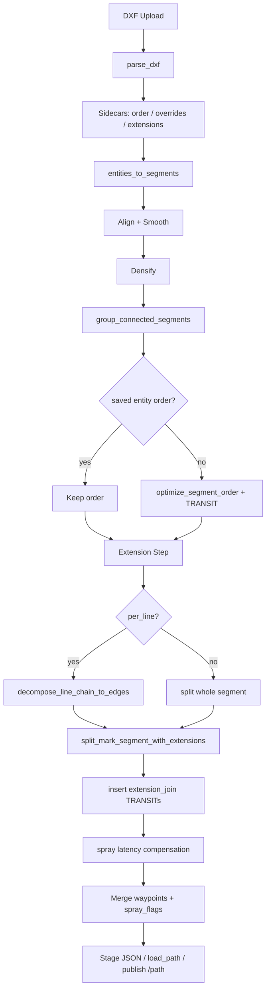

# Path Extension Planning & DXF Entity Alignment — Code Audit

**Date:** 2026-06-18  
**Scope:** Path engine / backend planning flow only (no code changes)

---

## Executive summary

The path planning stack is coherent and well-tested. Flow is:

**DXF parse → entity sidecars (order/overrides/extensions) → `PathEngine._plan_from_segments()` → staged JSON or controller load.**

PRE/MARK/AFT extension logic lives in `path_engine/planners/extensions.py` and is orchestrated from `path_engine/engine.py` **after** shape grouping and TSP ordering. Spray state is driven strictly by `SegmentType` at merge time: TRANSIT = OFF, MARK = ON.

**Confirmed correct (high confidence):**
- LINE / ARC / CIRCLE tangent math is centralized (`dxf_arc_tangent`, `entity_extension_directions`)
- Legacy mode suppresses extensions on closed line chains (square/rectangle) by design
- `per_line` mode decomposes chains and gives each edge its own PRE/MARK/AFT
- Junction dedup preserves spray ON/OFF transitions when flags differ
- Saved entity order disables the optimizer and is honored in preview + plan
- RPP fuses collinear PRE→MARK→AFT for tracking **without** changing spray flags

**Risks / gaps found:**
1. **Preview vs plan mismatch for `per_line=True`** — entity preview still uses vertex-anchored freeness; plan emits per-edge extensions on closed squares.
2. **Preview vs plan mismatch for CIRCLE** — preview treats self-closed entities as having no free ends; planner still adds PRE/AFT via analytic tangents.
3. **`chain_members` metadata is written but never read** — engine uses `decompose_line_chain_to_edges()` instead; comment in `shape_grouping.py` is stale.
4. **`POST /api/path/plan` body fields `selected_entities`, `overrides`, `order` are rejected (422)** — only sidecars work today.
5. **LWPOLYLINE with bulges** — no tangent metadata → extensions silently skipped (warning logged).
6. **Entity transit preview** shows DXF-order connectors, not optimizer/TSP order.

No architecture rewrite is needed. Fixes are localized to preview alignment, optional metadata cleanup, and missing tests.

---

## Files and functions reviewed

| Area | Files |
|------|-------|
| Core models | `path_engine/core.py` — `DXFEntity`, `PathSegment`, `SegmentType`, `PlannedPath`, `dxf_arc_tangent()` |
| DXF parse | `path_engine/parsers/dxf_parser.py` — `parse_dxf()`, `entities_to_segments()` |
| Extension planner | `path_engine/planners/extensions.py` — `split_mark_segment_with_extensions()`, `decompose_line_chain_to_edges()`, `entity_extension_directions()` |
| Pipeline | `path_engine/engine.py` — `PathEngine`, `_plan_from_segments()`, `_insert_transit_connectors_between_segments()`, `_align_extension_boundaries_to_compensated_marks()` |
| Grouping | `path_engine/optimizers/shape_grouping.py` — `group_connected_segments()`, `_merge_chain()` |
| Ordering | `path_engine/optimizers/segment_order.py` — `optimize_segment_order()`, `_reverse_segment()` |
| Entity order | `path_engine/entity_order.py` — `apply_entity_order()` |
| Spray latency | `path_engine/spray.py` — `apply_spray_latency_compensation()` |
| Server API | `server/routes/path.py`, `server/path_manager.py` |
| Controller | `server/offboard_controller.py`, `server/mission_loading.py`, `src/rpp_controller_node.py` |
| Tests | `path_engine/tests/test_extensions.py`, `test_entity_order.py`, `server/test_path_api.py`, `server/test_staged_endpoints.py` |

---

## Actual code flow step-by-step

### 1. DXF upload / parse

```
POST /api/path/upload  OR  POST /api/path/parse-dxf
  → PathManager.save_uploaded() / temp parse
  → path_engine.parsers.dxf_parser.parse_dxf()
```

- Iterates modelspace; maps DXF (x,y) → NED (north,east) = (y·s, x·s) (`dxf_parser.py:158-159`)
- `$INSUNITS` auto-scales to metres (`dxf_parser.py:52-69, 126-135`)
- Each entity gets `entity_id` = ezdxf handle (`dxf_parser.py:146`)
- Upload clears sidecars: overrides, extensions, entity order (`server/routes/path.py:724-726`)

### 2. Entity preview (no full plan)

```
GET /api/path/{name}/entities
  → parse_dxf (cached)
  → load sidecars: entity_order, overrides, extension_config
  → apply_entity_order()
  → per-entity preview points + extension_preview + transit_preview
```

Preview geometry is **not** densified at plan spacing; arcs use `_arc_points()` (`server/routes/path.py:128-149`). Extension direction uses the same `entity_extension_directions()` as the planner (`extensions.py:207-247`).

### 3. Entity ordering

```
POST /api/path/{name}/entities/order
  → validates full ID set
  → saves .{name}.entity_order.json
```

At plan time (`path_manager.py:984-987`):

```python
effective_optimize = optimize and not bool(saved_order)
```

Saved order → **optimizer off**; entities passed to `plan_dxf_entities()` in saved order (`path_manager.py:1010-1032`).

### 4. Plan generation

```
PathManager.plan_path() / preview_path()
  → resolve_extension_settings() from .extensions.json
  → PathEngine(...)
  → plan_file() OR plan_dxf_entities()
```

**`PathEngine._plan_from_segments()` pipeline** (`engine.py:410-417`):

| Step | What |
|------|------|
| 0 | GPS/affine alignment; rotate tangents with geometry |
| 1 | Corner smoothing (skips ARC/CIRCLE/SPLINE/ELLIPSE) |
| 2 | Densify all segments |
| 2b | `group_connected_segments()` — chain adjacent line-like MARK into `LINE_CHAIN` |
| 3 | `optimize_segment_order()` — NN + 2-opt + TRANSIT inserts (if enabled) |
| 4 | **Extensions** — `decompose_line_chain_to_edges()` if `per_line`; then `split_mark_segment_with_extensions()`; `_insert_transit_connectors_between_segments()` |
| 5 | Spray latency compensation on MARK only; re-align PRE/MARK/AFT boundaries; re-insert connectors |
| 5b | Redensify TRANSIT (PRE/AFT at mark spacing) |
| 6 | Merge → `merged_waypoints` + `spray_flags`; optional `close_loop` |

### 5. Staged mission / load-to-controller

| Endpoint | Role |
|----------|------|
| `POST /api/path/plan` | Full plan; stages if aligned + `include_waypoints` |
| `POST /api/path/{name}/plan-and-stage` | Same, name from URL |
| `GET /api/path/staged/{mission_id}` | Inspect artifact |
| `POST /api/path/load-to-controller` | `offboard_ctrl.load_path(waypoints, spray_flags)` — no re-plan |
| `GET /api/path/{name}/segments` | Verification segments with roles |
| `POST /api/mission/load` | `load_path_for_controller()` → `plan_path()` + spray flags from preview |

Staged payload (`server/routes/path.py:909-922`): `anchor`, `waypoints`, `spray_flags`, alignment metadata.

---

## DXF entity handling

### LINE / ARC / CIRCLE parsing

| Type | Parse (`parse_dxf`) | Segments (`entities_to_segments`) | Tangent metadata |
|------|---------------------|-----------------------------------|------------------|
| **LINE** | `start`, `end` in geometry | 2-point segment | `geometry_type: LINE` — finite-diff at extension time |
| **ARC** | center, radius, start/end angles | `densify_arc_from_dxf()` | `start_tangent`, `end_tangent` via `dxf_arc_tangent()` (`dxf_parser.py:597-601`) |
| **CIRCLE** | center, radius | `densify_circle()` CCW from 0° | Both tangents at 0° (`dxf_parser.py:566-570`) |
| **LWPOLYLINE** | vertices, bulges, closed | bulge → `LWPOLYLINE_BULGE`; else vertices | No tangents for bulge; plain polyline uses finite-diff |
| **SPLINE/ELLIPSE** | `make_path` + flatten | vertex polyline | Finite-diff tangents (`dxf_parser.py:653-665`) |

Tangent formula (`core.py:12-20`):

```
CCW at θ: (cos θ, -sin θ)  in (north, east)
```

### IDs and order preservation

- **Stable ID:** `entity_id` = DXF handle; survives in `source_entity` as `LINE_{handle}`, `ARC_{handle}`, etc.
- **`segment_id`:** monotonic counter in `entities_to_segments()` — **not** the DXF handle (`dxf_parser.py:503-537`)
- **UI reorder:** sidecar only; `apply_entity_order()` reorders before `entities_to_segments()`
- **Optimizer:** can reverse whole segments and swap/negate tangents (`segment_order.py:22-46`); updates `chain_members` on reversal
- **Grouping:** merges connected line MARK into `group:{first}+{n-1}` with `grouped_from` and `chain_members`

### UI reordering vs final planning

- Saved order → parser order for segment list input; optimizer skipped
- Without saved order → TSP may reverse segments and insert `transit:N` connectors
- **Grouping still runs on adjacent segments in list order** — inserting a non-connected entity between two lines **prevents** chaining (`shape_grouping.py:225-302`)

---

## Extension planning

### Where PRE / MARK / AFT are created

**`split_mark_segment_with_extensions()`** (`extensions.py:331-486`):

```
[PRE TRANSIT] + [MARK copy] + [AFT TRANSIT]
```

- PRE: `points = [start - pre·m·û_start, start]`, `extension_role: "pre"`
- AFT: `points = [end, end + aft·m·û_end]`, `extension_role: "aft"`
- Only when `segment_type == MARK` and direction is derivable

**Direction priority** (`extensions.py:390-440`):
1. `metadata["start_tangent"]` / `end_tangent` — ARC/CIRCLE/SPLINE/ELLIPSE
2. Line-like finite difference from densified endpoints — LINE / LWPOLYLINE / LINE_CHAIN
3. Else unchanged + warning

### Does every MARK entity get its own PRE and AFT?

**No — by design.**

| Mode | Behavior |
|------|----------|
| **Default (`per_line=False`)** | One PRE/AFT per **grouped open chain** at true open ends only. Closed square → **no** extensions (`_is_closed_run`, `extensions.py:415-421`). Internal corners get none. |
| **`per_line=True`** | `decompose_line_chain_to_edges()` at 30° corners (`extensions.py:265-324`); each edge gets PRE/MARK/AFT; `suppress_closed_loops=False` (`engine.py:686-697`). |
| **ARC/CIRCLE** | One PRE/MARK/AFT per arc/circle segment (not subject to line closed-run guard). |
| **TRANSIT** | Never extended. |

### Tangent alignment

- ARC/CIRCLE: analytic tangents from DXF angles; reversed correctly on optimizer flip (`segment_order.py:25-29`)
- Lines: local chord direction from first/last densified segment
- Affine alignment rotates tangents with points (`engine.py:552-559`)
- Spray compensation shifts MARK endpoints; `_align_extension_boundaries_to_compensated_marks()` re-stitches PRE/MARK/AFT (`engine.py:99-128`)

### Spray state

| Segment | `SegmentType` | `spray_flags` at merge |
|---------|---------------|------------------------|
| PRE | TRANSIT | `False` |
| MARK | MARK | `True` |
| AFT | TRANSIT | `False` |
| Optimizer `transit:N` | TRANSIT | `False` |
| `transit:extension_join:N` | TRANSIT | `False` |

Merge dedup (`engine.py:790-794`):

```python
if d < 0.01 and spray_flags[-1] == is_mark:
    continue  # skip only when spray state matches
```

Coincident points with **different** spray flags are kept (tested in `test_extensions.py:769-779`).

---

## Grouping / chain logic

### `group_connected_segments()` (`shape_grouping.py`)

- Chains line-like MARK by endpoint coincidence (default 5 cm)
- Curved MARK (ARC/CIRCLE/SPLINE/ELLIPSE/bulge) **never** merged
- Emits `LINE_CHAIN` with `line_like: True`, `grouped_from`, `chain_members`
- At degree>2 junctions, picks straightest continuation

### Extensions: per entity vs per group

| `per_line` | Extension unit |
|------------|----------------|
| `False` | Whole `LINE_CHAIN` (or single LINE) |
| `True` | Each decomposed edge (`:edge{k}` suffix) |

### Closed-loop suppression

**Intentional** for legacy mode — avoids diagonal AFT→PRE spurs at corners (`engine.py:667-677`, `test_extensions.py:649-692`).

**`per_line=True` overrides** — square gets 4×(PRE+MARK+AFT) (`test_extensions.py:1334-1344`).

### `chain_members` dead path

`shape_grouping.py:196-210` says `chain_members` is read by the extension step, but **`engine.py` never reads it** — it uses geometric `decompose_line_chain_to_edges()` on composite points. Usually equivalent for axis-aligned squares; could diverge if corner detection (30°) disagrees with grouped edge boundaries.

---

## Final output verification

### What reaches the controller

1. **Staged path:** `merged_waypoints` + parallel `spray_flags` → `OffboardController.load_path()` (`server/routes/path.py:1004-1005`)
2. **Mission load:** `path_mgr.load_path()` → full `plan_path()` → same arrays (`server/mission_loading.py:86-100`)
3. **ROS /path topic:** `path_publisher_node` / `ros_node.publish_path()` with spray flags
4. **RPP:** `/path` + flags; auto profile splits at flag transitions; `_merge_collinear_runs()` fuses PRE/MARK/AFT for motion only (`rpp_controller_node.py:664-667, 1069-1097`); spray gated by `_segment_spray_active()` requiring **both** adjacent flags True (`rpp_controller_node.py:3394-3401`)

### PRE/MARK/AFT boundaries

- Preserved in `plan.segments` with `segment_role` / `is_extension` (`path_manager.py:788-800, 1087-1106`)
- `GET /api/path/{name}/segments` exposes them when extensions enabled
- Boundary continuity enforced after spray compensation

### Duplicate merging

- Safe for spray transitions (flag mismatch → keep both points)
- Risk only if two MARK points coincide within 1 cm — second dropped (same flag). Unusual after densification.

### Connector / transit segments

| Source | `source_entity` | Metadata |
|--------|-----------------|----------|
| Optimizer | `transit:N`, `transit:start` | — |
| Extension gaps | `transit:extension_join:N` | `extension_connector: True` |
| PRE/AFT | `{parent}:pre`, `{parent}:aft` | `extension_role`, `parent_source_entity` |

---

## Confirmed correct behavior

1. Open line / open L-chain: PRE at chain start, AFT at chain end; spray OFF→ON→OFF (`test_extensions.py:694-744`)
2. Closed square legacy: extensions suppressed; clean single MARK loop (`test_extensions.py:649-681`)
3. ARC/CIRCLE extensions use metadata tangents; reversal updates tangents (`test_extensions.py:943-1171`)
4. Saved entity order disables optimizer; preview matches plan order (`test_entity_order.py`, `path_manager.py:662-664`)
5. Extension config sidecar drives preview, plan, and `load_path` consistently (`path_manager.py:374-393`)
6. `anchor="first_waypoint"` with `auto_origin` places rover at first driven point (PRE when extensions on) (`engine.py:761-779`, `path_manager.py:901-913`)
7. Entity overrides applied before planning; `ignore` layer wins over override (`core.py:137-141`)

---

## Bugs or risky logic

### 1. Entity preview ignores `per_line` (medium)

`GET /entities` uses `_extension_endpoint_freeness()` per entity (`server/routes/path.py:169-200, 452-471`). It does not read `extension_config.per_line`.

**Effect:** With `per_line=True` on a closed square, preview shows **no** extensions per entity, but plan emits **4 per-edge** PRE/AFT triplets.

### 2. CIRCLE preview vs plan mismatch (medium)

`_extension_endpoint_freeness()` marks self-closed entities `(False, False)` (`server/routes/path.py:196-198`). Planner still extends circles via tangent metadata (not line-like closed guard).

**Effect:** UI shows no circle extensions; execution adds PRE/AFT at the East point.

### 3. `chain_members` unused (low — doc drift)

Written in `shape_grouping.py:200-210`; engine uses geometric decomposition only. Reversal maintains `chain_members` but nothing consumes it for extensions.

### 4. Bulge LWPOLYLINE: no extensions (low — documented gap)

`LWPOLYLINE_BULGE` excluded from line-like; no tangent metadata → warning + no PRE/AFT (`extensions.py:177-181`, `dxf_parser.py:621-644`).

### 5. `POST /api/path/plan` preview body fields rejected (low — API contract)

`selected_entities`, `overrides`, `order` return 422 (`server/routes/path.py:751-761`). Mobile must use sidecar endpoints.

### 6. `transit_preview` is DXF-order fiction (low)

`_entity_transit_previews()` chains consecutive MARK entities in **entity list order**, not TSP order (`server/routes/path.py:256-277`). Misleading when optimizer runs.

### 7. `plan_metadata["extension_config"]` omits `per_line` (cosmetic)

`path_manager.py:1057-1061` logs enabled/pre/aft only.

---

## Missing tests

| Gap | Suggested test |
|-----|----------------|
| `per_line=True` entity preview alignment | `GET /entities` with `per_line` saved → each LINE shows PRE+AFT on closed square |
| CIRCLE preview vs plan | Entity preview disabled, `/segments` shows pre/aft for circle |
| `chain_members` vs `decompose_line_chain_to_edges` equivalence | Grouped chain with slight corner noise |
| Bulge polyline extensions | Expect warning / no extension |
| Saved order + grouping interaction | Order A, unrelated C, B — A and B not grouped |
| Optimizer + multi-entity extensions | Two distant lines → two PRE/MARK/AFT blocks + transit between |
| `plan_metadata` includes `per_line` | After fix |
| End-to-end: staged artifact spray runs match `/segments` | Cross-check `segment_runs` vs segment list |

Existing coverage is strong in `test_extensions.py` (700+ lines) and `test_entity_order.py`.

---

## Recommended fixes

**Priority 1 — Preview alignment (no pipeline change)**

In `server/routes/path.py` `path_entities()`:
- Pass `extension_config.per_line` into extension preview logic
- When `per_line=True`, preview per-entity PRE/AFT without freeness suppression (or decompose each entity's preview polyline to edges)
- For CIRCLE/closed ARC: either preview analytic PRE/AFT like `entity_extension_directions()`, or document that preview uses connectivity policy and circles are special

**Priority 2 — Metadata cleanup (optional)**

- Update `shape_grouping.py` comment: `chain_members` is for reversal traceability, not extension input
- OR switch `per_line` decomposition to iterate `chain_members` when present (preserves exact grouped edges)

**Priority 3 — API completeness**

- Wire `POST /plan` `overrides`/`order` to sidecars, or remove from schema
- Add `per_line` to `plan_metadata["extension_config"]`

**Do not change** legacy closed-square suppression or merge dedup logic — both are validated and match RPP behavior.

---

## Exact files/functions to change (if fixing)

| Issue | File | Function(s) |
|-------|------|-------------|
| Preview `per_line` | `server/routes/path.py` | `path_entities()`, `_entity_extension_preview()`, `_extension_endpoint_freeness()` |
| CIRCLE preview | `server/routes/path.py` | `_extension_endpoint_freeness()` or special-case in `_entity_extension_preview()` |
| Use `chain_members` for per-line | `path_engine/engine.py` | Step 4 loop ~`678-708` |
| Stale comment | `path_engine/optimizers/shape_grouping.py` | `_merge_chain()` docblock ~196-199 |
| Plan metadata | `server/path_manager.py` | `plan_path()` ~1057-1061 |
| Bulge tangents (if desired) | `path_engine/parsers/dxf_parser.py` | `entities_to_segments()` LWPOLYLINE bulge branch |
| API body fields | `server/routes/path.py` | `plan_path()`, `plan_and_stage()` |

---

## Pipeline diagram



---

*Audit performed against PX4_DXP codebase, 2026-06-18. No files were modified during the audit.*