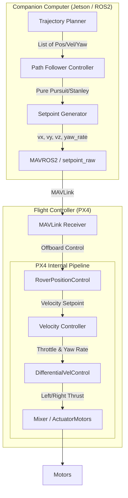

# T3: Controller Pipeline — Trajectory to OFFBOARD Commands

## 1. Control Pipeline Diagram

The complete pipeline from a high-level trajectory to motor commands involves a hierarchy of controllers. The distribution between the Companion Computer (Jetson) and the Flight Controller (PX4) depends on the chosen setpoint type.

### Data Flow Description
1. **Trajectory:** A list of waypoints $(x, y, \theta, v)$ generated by the planning node.
2. **Path Follower (Jetson):** Computes the necessary motion commands to stay on the path. For differential drive, this outputs a linear forward velocity ($v_{fwd}$) and a yaw rate ($\omega$).
3. **Setpoint Generator (Jetson):** Transforms body-frame commands ($v_{fwd}, \omega$) into the frame required by MAVROS (typically `LOCAL_NED` velocity + yaw setpoint).
4. **MAVROS2:** Packs commands into MAVLink `SET_POSITION_TARGET_LOCAL_NED` messages at 50Hz.
5. **PX4 Rover Position Control:** Accepts the velocity setpoint. If the setpoint is velocity, it skips the position P-loop and feeds directly into the velocity controller.
6. **DifferentialVelControl:** Converts desired forward speed and yaw rate into left/right motor thrusts (e.g., $L = v - k\omega, R = v + k\omega$).

---

## 2. Controller Hierarchy: Jetson vs. PX4

The control responsibilities shift based on the **Setpoint Type**.

### Scenario A: Position Setpoints (`type_mask` enables Position)
*   **Jetson:** Sends target coordinates $(x, y)$.
*   **PX4:** Runs the **Position Controller** (P-loop on position error $\to$ velocity) AND the **Velocity Controller** (PID on velocity error $\to$ motor thrust).
*   **Use Case:** Simple waypoint chasing (e.g., "Go to A").
*   **Downside:** Poor trajectory tracking. PX4 treats waypoints as point-mass targets, often cutting corners or stopping at each point.

### Scenario B: Velocity Setpoints (`type_mask` enables Velocity) — **Recommended**
*   **Jetson:** Runs the **Path Follower** (Pure Pursuit/Stanley). Calculates the exact velocity vector needed to follow the curve. Sends $(v_x, v_y, v_z, \text{yaw\_rate})$.
*   **PX4:** Runs only the **Velocity Controller**.
*   **Use Case:** Arc following, line marking, precise trajectory tracking.
*   **Benefit:** The Jetson has the "global path context" (knows the line is curved ahead), while PX4 only knows the immediate command.

### Controller Summary Table

| Controller | Type | Runs On | Purpose |
| :--- | :--- | :--- | :--- |
| **Path Follower** | Geometric / Kinematic | **Jetson** | Converts Path $\to$ Motion Commands ($v, \omega$). |
| **Velocity Control** | PID | **PX4** | Tracks commanded velocity despite disturbances (friction, slopes). |
| **Heading Control** | PID (part of Vel Control) | **PX4** | Tracks commanded yaw rate. |
| **Mixer** | Algebraic | **PX4** | Maps $(v, \omega) \to$ Left/Right motor outputs. |

---

## 3. Pure Pursuit for Differential Drive

### Adaptation for Differential Drive
Standard Pure Pursuit computes a steering angle $\delta$ for Ackermann steering. For differential drive, we do not have a steering angle; we have a yaw rate $\omega$.

**The Conversion:**
1. **Find Lookahead Point:** On the path, find the point $P$ that is distance $L_d$ ahead of the robot.
2. **Calculate Curvature ($\kappa$):** The curvature required to reach $P$.
   $$ \kappa = \frac{2 \sin(\alpha)}{L_d} $$
   Where $\alpha$ is the angle between the robot's heading and the vector to $P$.
3. **Compute Yaw Rate ($\omega$):**
   $$ \omega = v \cdot \kappa = \frac{2 v \sin(\alpha)}{L_d} $$
   Where $v$ is the current forward speed.

### Tuning for 0.3-0.4 m/s & ±2cm Accuracy
*   **Lookahead Distance ($L_d$):**
    *   At low speeds (0.3 m/s), a small lookahead is needed for accuracy.
    *   **Recommendation:** $L_d = 0.4 \text{ to } 0.6 \text{ meters}$.
    *   *Rule of Thumb:* $L_d$ should be proportional to speed ($L_d = k \cdot v$). For marking, fixed $L_d \approx 1.5 \times \text{robot\_length}$ is a good start.
*   **Behavior on Path Elements:**
    *   **Straight Lines:** $\alpha \approx 0 \to \omega \approx 0$. Robot tracks straight.
    *   **Arcs:** Constant $\omega$ tracks the curve. Pure Pursuit handles arcs very well.
    *   **Sharp Corners (90°):** Pure Pursuit naturally "cuts corners" because it pulls toward the lookahead point. To hit the apex, the robot must slow down (reducing lookahead effectively) or use a transition strategy (e.g., stop-and-turn).

### Limitation: U-Turns & Rotation in Place
Pure Pursuit requires forward velocity ($v > 0$) to generate yaw rate ($\omega$). It **cannot** command a rotation in place ($v=0, \omega \neq 0$).
*   **Solution:** Implement a logic switch in the Jetson node:
    *   *If Heading Error > 45°:* Enter "Spin Mode". Stop robot ($v=0$), apply fixed yaw rate until aligned.
    *   *Else:* Run Pure Pursuit.

---

## 4. Stanley vs. Pure Pursuit vs. MPC

### Comparison for Marking Rover

| Feature | Pure Pursuit | Stanley Controller | MPC (Model Predictive) |
| :--- | :--- | :--- | :--- |
| **Mechanism** | Looks ahead on path. | Corrects Cross-Track Error (CTE) + Heading Error. | Optimizes future states over a horizon. |
| **Pros** | Very smooth steering; robust at speed; easy to tune ($L_d$). | High accuracy on straights; explicitly penalizes CTE; works at low speeds. | Handles constraints (max speed); optimal cornering; predictive. |
| **Cons** | Cuts corners; oscillates on straights if $L_d$ small. | Can be "twitchy" at high speeds; needs tuning of gain $k$. | Computationally heavy; complex to implement on Jetson reliably. |
| **Accuracy** | Good (±5cm typical). | **Excellent (±2cm achievable).** | Excellent. |

### Recommendation for Phase 2
**Recommendation: Pure Pursuit (Initial) $\to$ Stanley (Refinement).**

*   **Why Pure Pursuit?** It is the simplest to implement and debug. For a marking rover moving at 0.3 m/s, it will likely achieve the ±2cm accuracy on straight lines if the lookahead is tuned low ($L_d \approx 0.5m$).
*   **Why not MPC?** Overkill for the low speed and simple geometry of sports field marking. Increases latency risk.
*   **Commercial Practice:** Most commercial line markers (Turf Tank, etc.) use Pure Pursuit variants or simple PID-on-cross-track-error. Stanley is commonly found in autonomous delivery robots (e.g., Starship) for sidewalk navigation accuracy.

---

## 5. PX4 Internal Controller & OFFBOARD Mode

### What happens in OFFBOARD?
When `OFFBOARD` mode is active:
1.  **Position Control:** PX4 checks the `type_mask` in the MAVLink message.
    *   If `Position` bits are set (ignored): PX4 **bypasses** the Position P-Loop. It does *not* calculate velocity from position error.
    *   If `Velocity` bits are set (ignored): PX4 **bypasses** the Velocity PID-Loop (Direct throttle control - dangerous for rovers).
    *   **Standard Rover Config:** We send Velocity Setpoints. PX4 Position Controller is **Bypassed**. The Velocity Controller is **Active**.

### The Velocity Controller (`RoverPositionControl`)
*   **Input:** Desired velocity in NED frame.
*   **Process:**
    1.  Transforms NED velocity to Body frame.
    2.  Calculates speed error and yaw rate error.
    3.  **PID Loop:** Outputs normalized throttle and steering (yaw rate).
*   **Mixer (`DifferentialVelControl`):**
    *   Takes forward speed ($v$) and yaw rate ($\omega$).
    *   Calculates Left/Right wheel speeds: $V_L = v - \omega \cdot W/2$, $V_R = v + \omega \cdot W/2$ (where $W$ is wheelbase).
    *   This module runs regardless of OFFBOARD/MANUAL if using velocity control.

---

## 6. RPP (Rover Pure Pursuit) Controller

### What is it?
RPP is a **PX4 Internal Module** introduced in newer firmware versions (v1.14+). It is an alternative to the standard P-Loop position controller.

### How it works
*   If you send **Position Setpoints** to PX4, and the parameter `RPP_POS_GAIN` is configured, PX4 will use a Pure Pursuit algorithm internally to convert that Position Setpoint into a Velocity Setpoint.
*   It allows the rover to "look ahead" rather than blindly steering towards the target point (standard P-loop behavior).

### Should we use it?
**No (for our Phase 2 architecture).**
*   **Reasoning:** We want to implement the control logic on the Jetson.
    *   Using PX4's RPP locks us into PX4's implementation and tuning parameters.
    *   We lose the ability to inject custom logic (e.g., "Stop painting if error > 5cm").
    *   Implementing Pure Pursuit on Jetson (sending Velocity SPs) gives us full authority over the behavior and makes the code portable to other platforms (ROS2 generic).

---

## 7. Setpoint Type Selection

### Decision: Velocity Setpoints (Type Mask `3527` equivalent)
We should send **Velocity + Yaw Rate** commands.

**Why?**
1.  **Arc Accuracy:** To paint an arc, we need to command a continuous velocity vector. Position setpoints require the rover to hit specific discrete points, which causes "stop-and-go" or zigzag behavior at update rates.
2.  **Control Loop Separation:**
    *   *Outer Loop (Jetson):* Geometry & Path Following. "Stay on the line."
    *   *Inner Loop (PX4):* Dynamics & Motors. "Maintain speed despite the grass friction."
    *   This separation is robust. PX4 handles the motor jitter; Jetson handles the line geometry.

### Hybrid Approach?
"Position for station keeping, velocity for transit" is complex to manage state-wise.
**Better approach:**
Always send Velocity Setpoints.
*   **For Station Keeping:** Send Velocity Vector = (0, 0, 0) and Yaw = Target Yaw. PX4 will hold position (if configured with `RAT_YAW_P` and `RAT_FW_P` gains for damping) or at least hold heading.

---

## 8. Control Loop Timing & Latency

### Timing Requirements
*   **Setpoint Stream:** 50Hz (20ms interval).
*   **Controller Computation (Jetson):** Must complete in < 10ms.
    *   Pure Pursuit is $O(N)$ where $N$ is path points. With $N=100$, this is microseconds on a Jetson. Very safe.

### Latency Sources
1.  **MAVROS $\leftrightarrow$ PX4 Link:**
    *   UART at 921600 baud is instant for the small message size (~50 bytes).
    *   **MAVROS Publishing:** ~1-2ms.
2.  **Position Estimate Latency (Critical):**
    *   GPS/RTK $\to$ EKF2 $\to$ MAVLink $\to$ MAVROS.
    *   At 0.3 m/s, a 100ms latency results in 3cm of position error *unaccounted for*.
    *   **Mitigation:** The PX4 EKF2 predicts forward. MAVROS `/local_position/pose` is time-stamped.
    *   **Action:** In the Jetson controller, use the time-stamp to calculate where the robot *is now* based on the delayed pose and current velocity.

### Summary of Latency Impact on ±2cm Goal
At 0.3 m/s, the robot moves 3cm every 100ms.
*   If the control loop takes 100ms, the command sent is based on where the robot *was* 3cm ago.
*   **Solution:** Keep the control loop fast (50Hz). Pure Pursuit inherently handles latency better than PID because it targets a point in the *future* (the lookahead point).

## Deliverables Summary

1.  **Pipeline:** Jetson (Pure Pursuit $\to$ NED Velocity) $\to$ MAVROS $\to$ PX4 (Velocity Controller $\to$ Mixer).
2.  **Boundary:** Path Following on **Jetson**; Velocity tracking & Mixing on **PX4**.
3.  **Controller:** **Pure Pursuit** (simplest, robust). If corner cutting is unacceptable, switch to **Stanley**.
4.  **Setpoint:** **Velocity** (Body frame $\to$ NED transform on Jetson).
5.  **RPP:** Ignore for now. Use custom Pure Pursuit on Jetson for maximum flexibility.
