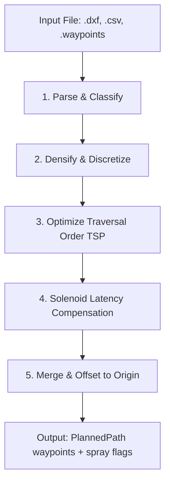

# DYX Path Planning Engine

A pure-Python path planning and geometric processing library for the DYX Autonomous 3WD Marking Rover. 

This package is designed to run with **zero ROS2 dependencies**, allowing for standalone testing, web server integration (via FastAPI), and offline CLI simulation, while generating precise relative North-East-Down (NED) coordinates and spray controls for the downstream RPP (Regulated Pure Pursuit) controller node.

---

## 🛠 Planning Pipeline Architecture

The engine processes raw CAD and waypoint mission files through a structured five-stage pipeline:



1. **Parse & Classify (`parsers/`)**: Loads geometric data from DXF, CSV, or QGC `.waypoints` files. Auto-detects layers or column properties to classify segments into `MARK` (spray ON) or `TRANSIT` (spray OFF).
2. **Densify & Discretize (`planners/`)**: Interpolates points along lines and curves based on target spacing rules (denser for marking accuracy, coarser for rapid transit) and curvature limits (using chord-error/sagitta constraints).
3. **Optimize Traversal Order (`optimizers/`)**: Solves a Traveling Salesperson Problem (TSP) using a nearest-neighbor heuristic with segment endpoint reversal to minimize total travel time (dead-heading) between spray segments.
4. **Solenoid Latency Compensation (`spray.py`)**: Shifts the physical start and end locations of marking lines to compensate for fluidic / mechanical delays in the spraying solenoid.
5. **Merge & Offset (`engine.py`)**: Combines all optimized segments into a single continuous polyline, offsets coordinates relative to a global coordinate origin (or rover startup point), and generates parallel binary spray command flags.

---

## 📁 File Registry

Here is a detailed breakdown of the purpose and behavior of each file in this directory:

### Core Definitions & Orchestration

| File | Type | Purpose & Details |
| :--- | :--- | :--- |
| [`__init__.py`](file:///Users/dyx_a1/Vetri/PX4_DXP/path_engine/__init__.py) | Module Entry | Exposes key public APIs (`PathEngine`, `SegmentType`, `PathSegment`, `PlannedPath`, `DXFEntity`) to external applications. |
| [`core.py`](file:///Users/dyx_a1/Vetri/PX4_DXP/path_engine/core.py) | Data Models | Defines the fundamental structural data models:<br>• `SegmentType`: Enum defining `MARK` (value 0, spray ON) and `TRANSIT` (value 1, spray OFF).<br>• `PathSegment`: Dataclass for a single contiguous line/curve segment (its points, target speed, type, and ID).<br>• `DXFEntity`: Intermediary representation of raw CAD entities before discretization.<br>• `PlannedPath`: The final package containing waypoints, spray command flags, and metrics. |
| [`engine.py`](file:///Users/dyx_a1/Vetri/PX4_DXP/path_engine/engine.py) | Engine Coordinator | Hosts the main `PathEngine` class. Implements `plan_file`, `plan_dxf_entities`, and `plan_segments` to run the coordinate scaling, segment sorting, densification, latency compensation, and final flattening pipeline. |
| [`ned.py`](file:///Users/dyx_a1/Vetri/PX4_DXP/path_engine/ned.py) | Transforms | Handles geodesy and geometry transforms:<br>• `latlon_to_ned`: Uses Karney's geodesic method (`GeographicLib.Geodesic`) for highly accurate latitude/longitude-to-metres conversion on the WGS84 ellipsoid.<br>• `dxf_to_ned_affine`: Calculates a 2D affine scale, rotation, and translation transform between DXF coordinates and real-world NED coordinates via a least-squares fit over N ≥ 2 reference point pairs (also returns per-point residuals and RMSE).<br>• `apply_affine_transform`: Transforms drawing points into the real-world frame. |
| [`spray.py`](file:///Users/dyx_a1/Vetri/PX4_DXP/path_engine/spray.py) | Compensator | Compensates for solenoid latency. Delays in fluid flow require the rover to command the solenoid early (lead-in) and stop early (lead-out). At the default `0.35 m/s` marking speed, a `0.10s` opening latency shifts the start point forward by **3.5 cm**, and a `0.01s` closing latency trims the endpoint backward by **3.5 mm**. |
| [`cli.py`](file:///Users/dyx_a1/Vetri/PX4_DXP/path_engine/cli.py) | CLI Entry point | Command-line interface for testing the planning engine standalone. Run as `python -m path_engine.cli <command>`. |

### Parsers (`parsers/`)

| File | Purpose & Details |
| :--- | :--- |
| [`parsers/__init__.py`](file:///Users/dyx_a1/Vetri/PX4_DXP/path_engine/parsers/__init__.py) | Dispatches file formats dynamically based on file extensions (`.dxf`, `.csv`, `.waypoints`). |
| [`parsers/csv_parser.py`](file:///Users/dyx_a1/Vetri/PX4_DXP/path_engine/parsers/csv_parser.py) | Parses CSV coordinates with backward compatibility:<br>• **2-Column Mode**: Legacy simple waypoints (North, East) in metres.<br>• **6-Column Mode**: Enhanced format (`north_m,east_m,spray_on,speed_m_s,segment_id,yaw_rad`) which is parsed and grouped into matching `PathSegment` objects. |
| [`parsers/dxf_parser.py`](file:///Users/dyx_a1/Vetri/PX4_DXP/path_engine/parsers/dxf_parser.py) | Leverages `ezdxf` to extract geometry from AutoCAD DXF drawings:<br>• Supports `LINE`, `POINT`, `CIRCLE`, `ARC`, `LWPOLYLINE`, `SPLINE`, `ELLIPSE`, and recursive `INSERT` (blocks).<br>• Uses the drawing's `$INSUNITS` header variable to auto-detect drawing scale (falling back to centimetres if missing).<br>• Categorizes entities into `MARK`/`TRANSIT` based on layer keywords (`TRANSIT`/`TRAVEL`/`MOVE`/`RAPID` force TRANSIT, all others default to MARK). |
| [`parsers/waypoints_parser.py`](file:///Users/dyx_a1/Vetri/PX4_DXP/path_engine/parsers/waypoints_parser.py) | Reads QGC WPL 110 `.waypoints` files. Uses the home waypoint (coordinate index 1) as the relative NED projection origin and projects all other mission coordinates onto the NED frame using `geographiclib`. |

### Planners & Discretization (`planners/`)

| File | Purpose & Details |
| :--- | :--- |
| [`planners/__init__.py`](file:///Users/dyx_a1/Vetri/PX4_DXP/path_engine/planners/__init__.py) | Initializes the path planners module. |
| [`planners/straight_line.py`](file:///Users/dyx_a1/Vetri/PX4_DXP/path_engine/planners/straight_line.py) | Densifies straight segments by inserting evenly-spaced waypoints. MARK segments default to a tight `0.05m` spacing for high drawing resolution, while TRANSIT segments use a coarser `0.15m` spacing. |
| [`planners/arc_curve.py`](file:///Users/dyx_a1/Vetri/PX4_DXP/path_engine/planners/arc_curve.py) | Generates curvature-adaptive points along circular arcs and curves using the **chord-error (sagitta)** method. The angular step is dynamically computed using $\theta = 2 \arccos(1 - \frac{e}{r})$, where $e$ is the max chord deviation (default `5 mm`) and $r$ is the radius. Tighter curves receive denser points, while gentle sweeps use wider spacing. Also parses DXF `LWPOLYLINE` bulge values (converting bulges to arcs using standard trigonometric formulas). |

### Optimizers (`optimizers/`)

| File | Purpose & Details |
| :--- | :--- |
| [`optimizers/__init__.py`](file:///Users/dyx_a1/Vetri/PX4_DXP/path_engine/optimizers/__init__.py) | Initializes the optimizers module. |
| [`optimizers/segment_order.py`](file:///Users/dyx_a1/Vetri/PX4_DXP/path_engine/optimizers/segment_order.py) | Minimizes dead-heading. Takes a set of `MARK` segments and reorders them using a Nearest-Neighbor TSP heuristic. Because lines can be painted in either direction, it considers both the start and end of each unvisited segment. If the end point is closer, it automatically reverses the segment's coordinate array. It then generates appropriate `TRANSIT` segments to link the consecutive marking shapes. |

### Unit Tests (`tests/`)

Unit tests reside in the `tests/` directory and use `pytest` for validation:
* [`conftest.py`](file:///Users/dyx_a1/Vetri/PX4_DXP/path_engine/tests/conftest.py): Bootstraps the local path variable so the parent library is importable.
* [`test_core.py`](file:///Users/dyx_a1/Vetri/PX4_DXP/path_engine/tests/test_core.py): Tests data model properties like path lengths, classification rules, and scales.
* [`test_engine.py`](file:///Users/dyx_a1/Vetri/PX4_DXP/path_engine/tests/test_engine.py): Tests pipeline orchestration, coordinate frame conversions, start positions, and TSP overrides.
* [`test_ned.py`](file:///Users/dyx_a1/Vetri/PX4_DXP/path_engine/tests/test_ned.py): Validates latitude/longitude projection distances and 2D affine registration solvers.
* [`test_parsers.py`](file:///Users/dyx_a1/Vetri/PX4_DXP/path_engine/tests/test_parsers.py): Verifies CSV parsers (2 vs 6 columns), QGC waypoints, and ezdxf mock CAD models.
* [`test_planners.py`](file:///Users/dyx_a1/Vetri/PX4_DXP/path_engine/tests/test_planners.py): Validates chord-error adaptive spacing, circle closures, straight lines, and LWPOLYLINE bulge parsing.
* [`test_spray.py`](file:///Users/dyx_a1/Vetri/PX4_DXP/path_engine/tests/test_spray.py): Validates physical lead-in and lead-out offsets on various line configurations.

---

## 🏃 Running the Standalone CLI

You can use the CLI to plan paths and inspect geometry files offline:

```bash
# Activate virtual environment if needed
source .venv-dev/bin/activate

# Plan a mission from a CAD drawing and output the points to a CSV
python -m path_engine.cli plan soccer_field.dxf -o planned_path.csv

# View details about a parsed DXF file
python -m path_engine.cli parse-dxf soccer_field.dxf

# View summary details of an existing mission file (waypoints or CSV)
python -m path_engine.cli info planned_path.csv
```

### Plan Arguments:
* `--origin`: Relative offset coordinates as `north,east` (e.g. `10.5,12.0`).
* `--start-position`: Current rover location for sorting. The TSP optimizer will begin search from this point.
* `--mark-spacing`: Spacing (m) along marking segments (default: `0.05` / 5 cm).
* `--transit-spacing`: Spacing (m) along transit lines (default: `0.15` / 15 cm).
* `--mark-speed`: Target speed (m/s) during marking (default: `0.35`).
* `--transit-speed`: Target speed (m/s) during transit (default: `0.50`).

---

## 🧪 Running Tests

Ensure all tests pass prior to deploying script updates:

```bash
.venv-dev/bin/pytest path_engine/tests
```
