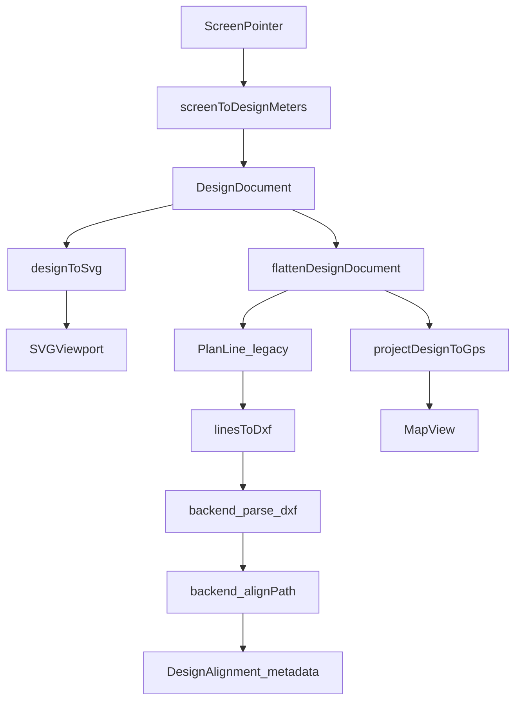

# Cartesian Design Canvas — Production Implementation Plan

> Read-only architecture and implementation plan.  
> Verified against repository: `Three_Wheel_v2` (Expo SDK 54 / React Native).  
> **Do not implement Manual Drawing until Phases 0–5 are complete.**

### Plan revisions (applied)

1. **No dual-write migration** — derive `DesignDocument` from `placedItems`, verify parity, then one atomic authority cutover (Phase 1).
2. **No blind pinch reversal** — ambiguous legacy items preserved as world-coordinate `DesignEntity` nodes with warnings.
3. **Deterministic template IDs** — stable keys (`shape:square:v1`, parameter hashes, geometry fingerprints); never `item.id`.
4. **Separate tolerances** — geometry/export/DXF: ±0.001 m; SVG/map preview parity: ±0.05 m.
5. **Phase 0 baseline-only** — test runner + characterize defects only; production types begin in Phase 1.

---

## A. Executive verdict

| Item | Decision |
|------|----------|
| **Architecture verdict** | **Requires significant staged refactoring** |
| **Proceed with implementation** | **Yes** — start Phase 0 → Phase 1 immediately |
| **Blockers** | None unresolved in repository; pinch/export inconsistency is a fixable defect, not a hard blocker |

**Rationale:** [`BoundaryEditor.tsx`](src/components/BoundaryEditor.tsx) already stores geometry in metres and keeps zoom/pan in the viewport, but authority is split across item-local `PlanLine[]`, `PlacedItem` placement transforms, duplicated flatten math in [`TemplatesPage.tsx`](src/screens/TemplatesPage.tsx) `handleParse`, and pinch handlers that mutate both line vertices and `item.scale`. Only one test file exists ([`visualAlignment.test.ts`](src/utils/visualAlignment.test.ts)); no test runner is configured in [`package.json`](package.json).

---

## B. Verified current-state findings

For each finding: file, function/component, behavior, evidence, risk, audit verdict.

### B1. North/east and X/Y conventions

| Finding | File | Function | Behavior | Evidence | Risk | Audit |
|---------|------|----------|----------|----------|------|-------|
| `PlanPoint.x` = north | [`visualAlignment.ts`](src/utils/visualAlignment.ts) | Contract header | Documented NED convention | L4–6 | Naming confusion | **Correct** |
| `PlanPoint.y` = east | Same | Same | L5–6 | Same | **Correct** |
| `PlacedItem.x` = east placement | Same | Same | L7–8 | Opposite of `PlanPoint` | **Correct** |
| `PlacedItem.y` = north placement | Same | Same | L8 | Swap bugs in forms | **Correct** |
| SVG maps east→X, north→−Y | [`BoundaryEditor.tsx`](src/components/BoundaryEditor.tsx) | render | `M${l.from.y * 100} ${-l.from.x * 100}` | L677–681 | Must centralize | **Correct** |
| DXF group 10/20 swap | [`dxfGenerator.ts`](src/utils/dxfGenerator.ts) | `linesToDxf` | `10=from.y`, `20=from.x` | L31–38 | Keep post-flatten only | **Correct** |
| Ref API `dxf_y=north`, `dxf_x=east` | [`visualAlignment.ts`](src/utils/visualAlignment.ts) | `buildVisualAlignmentRefPoints` | L81–83 | Alignment payload | **Correct** |
| Map click ref swap | [`App.tsx`](App.tsx) | `handleSelectPoint` | `dxf_x: pt.y, dxf_y: pt.x` | L7037–7044 | **Correct** |
| Font generator coord swap | [`characterTemplates.ts`](src/utils/characterTemplates.ts) | `generateTextLines` | `x: seg.p1.y`, `y: seg.p1.x` | L7397–7398 | Opaque but valid output | **Partially correct** |

### B2. SVG screen-to-design conversion

| Finding | File | Function | Behavior | Evidence | Audit |
|---------|------|----------|----------|----------|-------|
| Partial screen→SVG | [`BoundaryEditor.tsx`](src/components/BoundaryEditor.tsx) | `hitTest` | viewBox from camera + boundary size | L189–198 | **Correct** (incomplete) |
| No screen→design metres | — | — | Pan drag converts px→m separately L457–458 | Scattered logic | **Correct** |
| Alternate camera model | [`GeometryViewport.tsx`](src/components/GeometryViewport.tsx) | `invertCanvasTransform` | offset/zoom model | L1282–1313 | **Correct** — different component |

**Risk:** Two SVG camera models. New utilities target BoundaryEditor viewBox model first.

### B3. Pinch scaling behavior

| Finding | File | Evidence | Audit |
|---------|------|----------|-------|
| Pinch mutates line vertices | [`BoundaryEditor.tsx`](src/components/BoundaryEditor.tsx) L431–435 | `l.from.x * appliedScale` written into lines | **Correct** |
| Pinch updates `item.scale` | Same L426 | `scale: startP.scale * appliedScale` | **Correct** |
| MapView pinch same | [`MapView.tsx`](src/components/MapView.tsx) L2513–2527 | Scales lines + scale property | **Correct** |
| Map preview applies `item.scale` | [`MapView.tsx`](src/components/MapView.tsx) L1872–1873 via `transformVisualDxfPoint` | **Correct** |

**Critical risk (R1):** Lines pre-scaled by pinch + `transformVisualDxfPoint` applies `scale` again on map. **`handleParse` ignores `item.scale`** (L528–531) → export disagrees with map after pinch.

### B4. Export rotation and scale

| Finding | File | Evidence | Audit |
|---------|------|----------|-------|
| Inline flatten in export | [`TemplatesPage.tsx`](src/screens/TemplatesPage.tsx) `handleParse` L524–553 | Manual cos/sin + offsets | **Correct** |
| Matches `transformVisualDxfPoint` when scale=1 | Compare L528–531 vs [`visualAlignment.ts`](src/utils/visualAlignment.ts) L31–34 | **Correct** |
| `item.scale` not in `handleParse` | `handleParse` | No `* item.scale` | **Correct** |
| `handleApplyScale` bakes into lines | [`TemplatesPage.tsx`](src/screens/TemplatesPage.tsx) L384–388 | Also sets `item.scale` | **Correct** |

### B5. Boundary position behavior

| Finding | File | Evidence | Audit |
|---------|------|----------|-------|
| `boundaryPosition` moves visual boundary only | [`BoundaryEditor.tsx`](src/components/BoundaryEditor.tsx) L55–58, L267–273 | Items use absolute `item.x/y` | **Correct** |
| Export ignores `boundaryPosition` | `handleParse` L524–554 | No offset applied | **Correct** |
| Rover snap uses boundary offset | [`TemplatesPage.tsx`](src/screens/TemplatesPage.tsx) L163–170 | `worldX = bpX + cp.localX` | **Correct** |
| `boundaryLines` useMemo unused | [`TemplatesPage.tsx`](src/screens/TemplatesPage.tsx) L198–264 | Never referenced | **Correct** (dead code) |

**Conclusion:** `boundaryPosition` must **not** become `DesignFrame` origin per architecture decision.

### B6. Map preview anchoring

| Finding | File | Evidence | Audit |
|---------|------|----------|-------|
| Templates map empty ref points | [`TemplatesPage.tsx`](src/screens/TemplatesPage.tsx) L666 | `alignedRefPoints={[]}` | **Correct** |
| `latchedOrigin` from rover GPS | [`MapView.tsx`](src/components/MapView.tsx) L1616–1646 | Telemetry latch | **Correct** |
| Equirectangular projection | [`MapView.tsx`](src/components/MapView.tsx) / [`visualAlignment.ts`](src/utils/visualAlignment.ts) | `projectLocalMetersToGps` | **Correct** |

**Risk:** Preview drifts with rover motion.

### B7. Alignment mutation behavior

| Finding | File | Evidence | Audit |
|---------|------|----------|-------|
| Backend owns alignment | [`App.tsx`](App.tsx) `handleFixAlignment` L7126 | `pathApi.alignPath` | **Correct** |
| Point-click rewrites `lines` | [`App.tsx`](App.tsx) L7186–7221 | `setLines` transform | **Correct** (Fields only) |
| Visual alignment preserves source lines | [`App.tsx`](App.tsx) L639, L7181–7182 | Sticker separate | **Correct** |
| Templates isolated from Fields `lines` | [`TemplatesPage.tsx`](src/screens/TemplatesPage.tsx) in-memory state | **Correct** |

### B8. Persistence requirements

| Finding | Evidence | Audit |
|---------|----------|-------|
| No Templates session persistence | `placedItems` = `useState` only L62 | **Correct** |
| Export = DXF to backend | `handleParse` → `linesToDxf` → `/parse-dxf` | **Correct** |
| Templates code-generated | `shapeTemplates.ts`, `characterTemplates.ts`, etc. | **Correct** |

**Implication:** Migration is runtime session only. Design `schemaVersion` for future save/load.

### B9. Existing tests and gaps

| Item | Status |
|------|--------|
| [`visualAlignment.test.ts`](src/utils/visualAlignment.test.ts) | Standalone Node script |
| [`package.json`](package.json) | No `test` script |
| BoundaryEditor / Templates / export tests | **Missing** |
| [`manual_draw_.md`](manual_draw_.md) | Plan only, not implemented |

---

## C. Final target architecture

### C1. Design frame

```typescript
interface DesignFrame {
  originNorthM: number;  // default 0
  originEastM: number;   // default 0
}
```

- Units: metres
- North/east explicit in all new canonical types
- `boundaryPosition` is visual aid only — does not move design frame
- All coordinates finite, within ±10_000 m (configurable)

### C2. Canonical document

```typescript
interface DesignDocument {
  schemaVersion: 1;
  id: string;
  frame: DesignFrame;
  nodes: DesignNode[];
  revision: number;
}

type DesignNode = DesignEntity | DesignInstance;

type DesignEntityType = "LINE" | "POLYLINE" | "POINT" | "FREEHAND";

interface DesignVertex {
  northM: number;
  eastM: number;
}

interface DesignEntity {
  id: string;
  type: DesignEntityType;
  layer: string;
  vertices: DesignVertex[];
  width?: number;
  metadata?: Record<string, unknown>;
}

interface DesignInstance {
  id: string;
  type: "INSTANCE";
  templateId: string;
  transform: {
    northM: number;
    eastM: number;
    rotationDeg: number;
    scale: number;
  };
  metadata?: Record<string, unknown>;
}
```

**Hybrid node model:** Keep template geometry in registry (template-local frame). Flatten applies instance transform **once**. Do not bake templates into world entities on insert (matches current `PlacedItem` + `transformVisualDxfPoint` pattern).

### C3. Alignment model

```typescript
interface AlignmentReferencePoint {
  designNorthM: number;
  designEastM: number;
  lat: number;
  lon: number;
}

interface DesignAlignment {
  method: "single_point" | "least_squares" | "visual";
  offsetNorthM: number;
  offsetEastM: number;
  rotationDeg: number;
  scale: number;
  referencePoints: AlignmentReferencePoint[];
  pathName?: string;
  verifiedAt?: string;
  backendMetadata?: Record<string, unknown>;
}

// src/utils/designAlignmentPolicy.ts
const allowAlignmentScale = false;
```

**Rules:**
- Backend `alignPath` owns design→surveyed transform
- Source `DesignDocument` never modified by alignment
- Default scale = 1.0; least-squares scale requires explicit opt-in
- Re-alignment invalidates prior metadata; design `revision` change requires re-export

### C4. Flattened output

`flattenDesignDocument(doc, registry) → PlanLine[]` using legacy `PlanPoint` (`x=north`, `y=east`) for DXF/backend compatibility. **Single flatten boundary.**

### C5. Map preview anchor

```typescript
interface DesignPreviewAnchor {
  mode: "rover_latched" | "explicit_gps" | "aligned_ref";
  lat: number;
  lon: number;
}
```

### C6. Undo/redo commands

```typescript
type DesignCommand =
  | { type: "AddNode"; node: DesignNode }
  | { type: "DeleteNode"; nodeId: string; snapshot: DesignNode }
  | { type: "UpdateInstanceTransform"; nodeId: string; before: DesignInstance["transform"]; after: DesignInstance["transform"] }
  | { type: "UpdateEntityVertices"; nodeId: string; before: DesignVertex[]; after: DesignVertex[] }
  | { type: "UpdateFrame"; before: DesignFrame; after: DesignFrame }
  | { type: "Batch"; commands: DesignCommand[] };
```

Camera pan/zoom **excluded** from history.

### C7. Data flow

```text
Screen pointer
  → screenToDesignMeters()
  → DesignDocument (world frame, northM/eastM)
  → designToSvg() → SVG render (pixels viewport-only)
  → flattenDesignDocument() → PlanLine[] (legacy)
  → linesToDxf() → backend parse-dxf
  → backend alignPath (once)
  → DesignAlignment metadata (read-only)
  → projectDesignToGps() → MapView preview
```



### C8. Template registry

New file: [`src/utils/designTemplateRegistry.ts`](src/utils/designTemplateRegistry.ts)

**Deterministic `templateId` rules (never use `item.id`):**

| Source | ID format | Example |
|--------|-----------|---------|
| Built-in generators | `{category}:{variant}:v{schema}` + param suffix | `shape:square:v1`, `alphabet:A:smooth:v1`, `sports:cricket_icc:v1` |
| Parameterized size | hash of normalized params | `shape:square:v1@size=1.000` |
| Runtime snapshot ("+ Add") | geometry fingerprint of template-local lines | `snapshot:fp:{sha256_16}` |

- Registry stores immutable template-local lines keyed by deterministic ID
- `registerTemplate(def)` deduplicates by ID; same fingerprint → same ID
- Required because no `templateId` exists in repository today

### C9. Tolerance policy

| Domain | Tolerance | Applies to |
|--------|-----------|------------|
| **Geometry exact** | ±0.001 m | Flatten, DXF export, export→parse round-trip, screen↔design round-trip, migration parity (clean instances) |
| **Angle exact** | ±0.1° | Corner preservation, rotation |
| **Map preview parity** | ±0.05 m | SVG flattened geometry vs map GPS render (equirectangular projection + pixel rendering) |

Do not use a single tolerance for both local exact geometry and geographic preview.

---

## D. Migration strategy

### D1. Atomic authority cutover (no dual-write)

**Forbidden:** keeping `placedItems` and `DesignDocument` both editable and synced in parallel.

**Required sequence (Phase 1, single transaction):**

```text
1. User session still on placedItems (read-only during migration step)
2. migratePlacedItemsToDesignDocument(placedItems) → { document, registry, warnings }
3. parityCheck = compareFlattenOutputs(
     legacyFlatten(placedItems),      // existing handleParse math
     flattenDesignDocument(document)  // new path
   )
4. If parityCheck fails beyond tolerance → abort cutover, keep placedItems, surface errors
5. If ok → atomic cutover:
     setDesignDocument(document)
     setTemplateRegistry(registry)
     remove placedItems state
     route all mutations to DesignDocument only
```

| Stage | Authoritative store | `placedItems` |
|-------|-------------------|---------------|
| Phase 0 | `placedItems` | Source (unchanged) |
| Phase 1 pre-cutover | `placedItems` | Source; migration runs read-only |
| Phase 1 cutover (atomic) | `designDocument` | **Removed** — not kept editable |
| Phase 2+ | `designDocument` | Does not exist |

There is **no** dual-write phase. Rollback = restore previous git state or keep a one-shot backup snapshot taken immediately before cutover (not a second live editor).

### D2. `migratePlacedItemsToDesignDocument(placedItems, registry)`

For each `PlacedItem`, classify migration path:

**Path A — Clean instance (preferred when detectable):**

- `item.scale === 1` AND lines match a known registry template at identity transform, OR
- `item.scale !== 1` BUT lines are provably unscaled template-local (e.g. fresh "+ Add" with scale only on `item.scale`, never pinched)

→ Create `DesignInstance` with deterministic `templateId` and `transform: { northM: item.y, eastM: item.x, rotationDeg, scale }`.

**Path B — Ambiguous legacy (pinch/scale baked into lines):**

- `item.scale !== 1` AND lines appear pre-scaled in template-local space (heuristic: line bbox dimensions inconsistent with `width`/`height` and `scale`), OR
- Cannot resolve a stable template-local snapshot

→ **Do not guess** or reverse pinch scaling.

→ Flatten item to world coordinates using **current** legacy `handleParse` math (preserves visual/export behavior as-is).

→ Store result as one or more `DesignEntity` nodes (`LINE`/`POLYLINE`) in world frame with `metadata.migration: "legacy_world_entity"` and `metadata.sourceItemId: item.id`.

→ Emit warning: `{ code: "LEGACY_AMBIGUOUS_SCALE", itemId, message }`.

**Deterministic template IDs (Path A only):**

1. If item was created from known generator context (capture category/shape/size at "+ Add"), use structured ID e.g. `shape:square:v1@size=1.000`
2. Else compute `snapshot:fp:{fingerprint(templateLocalLines)}` from normalized template-local geometry
3. Never assign `templateId = item.id`

**Validation:** `validateDesignDocument(document)`; on failure return `{ ok: false, errors }` without cutover.

### D3. Parity verification before cutover

```typescript
function verifyMigrationParity(
  placedItems: PlacedItem[],
  document: DesignDocument,
  registry: TemplateRegistry,
  toleranceM = 0.001
): { ok: boolean; maxDeltaM: number; errors: string[] }
```

- Compare segment lengths and endpoint positions between legacy flatten and new flatten
- Clean instances: must pass ±0.001 m
- Legacy world entities (Path B): must match legacy flatten exactly (these were derived from it)

### D4. Reversibility

- **Pre-cutover:** no `DesignDocument` in production state — nothing to roll back
- **Cutover backup:** optional deep clone of `placedItems` in memory for same-session undo only (discarded on next mutation)
- **Post-cutover:** git revert; no `designDocumentToPlacedItems()` maintenance long-term

### D5. Saved documents

No persisted Templates sessions today. Future format: `DesignDocument` JSON + registry sidecar with deterministic template IDs.

### D6. Failure handling

- Migration or parity failure: **abort cutover**, retain `placedItems`, show errors (no partial document authority)
- Invalid post-cutover edits: `validateDesignDocument` rejects command before commit

---

## E. Detailed phase plan

### Phase 0 — Baseline and contract locking (baseline-only)

| Field | Value |
|-------|-------|
| **Priority** | Critical |
| **Objective** | Add test runner; characterize current behavior; document existing defects — **no production architecture** |
| **New files** | `src/utils/baselineGeometry.test.ts` (or similar), test runner entry in `package.json`, `docs/coordinate-conventions.md` (internal) |
| **Modify** | `src/utils/visualAlignment.test.ts` (integrate into runner) |
| **Explicitly NOT in Phase 0** | `src/types/designDocument.ts`, `designTransform.ts`, `designMigration.ts`, any `TemplatesPage` behavior change |
| **Reuse** | `visualAlignment.ts` contract, `shapeTemplates` 1m square, current `handleParse` |
| **Tasks** | 1) Add Vitest or `tsx` test script 2) Baseline: 1m square export length via current `handleParse` 3) Baseline: document pinch/export mismatch as **expected failing** characterization test 4) Baseline: boundary position does not affect export 5) Document north/east conventions in markdown only |
| **Tests** | Characterization only; failures are documented defects, not blockers for Phase 0 exit |
| **Exit** | Test runner works; baseline suite committed; defect list written; **zero production code changes** |
| **Rollback** | N/A |
| **Deps** | None |

### Phase 1 — Geometry foundation

| Field | Value |
|-------|-------|
| **Priority** | Critical |
| **Objective** | Introduce canonical types, validation, migration with atomic cutover, shared flatten, fix double-scale going forward, migrate export |
| **New files** | `src/types/designDocument.ts`, `designTransform.ts`, `designValidation.ts`, `designMigration.ts`, `designTemplateRegistry.ts`, `designAlignmentPolicy.ts`, `designTransform.test.ts` |
| **Modify** | `TemplatesPage.tsx`, `BoundaryEditor.tsx`, `MapView.tsx`, `visualAlignment.ts` |
| **Remove** | Inline `handleParse` flatten; dead `boundaryLines` useMemo; `placedItems` state after successful cutover |
| **Tasks** | 1) Add production types 2) `flattenDesignDocument` 3) Deterministic template IDs + registry 4) `migratePlacedItemsToDesignDocument` with Path A/B logic 5) `verifyMigrationParity` then **atomic cutover** (no dual-write) 6) Pinch: scale on transform only (forward fix) 7) `handleParse` uses flatten 8) Flip baseline pinch test green for **new** code path |
| **Tests** | 10m ±0.001m; 90° ±0.1°; scale once; NaN reject; migration parity ±0.001m (clean); legacy ambiguous → world entity warnings |
| **Exit** | Cutover complete; single authority `designDocument`; export flatten ±0.001m vs legacy on clean items; ambiguous items preserved as world entities |
| **Rollback** | Pre-cutover snapshot of `placedItems`; if cutover fails, abort before removing `placedItems` |
| **Deps** | Phase 0 |

**No Cartesian UI in Phase 1.**

### Phase 2 — Cartesian viewport

| Field | Value |
|-------|-------|
| **Priority** | High |
| **Objective** | Grid, axes, pointer readout, shared screen↔design |
| **Modify** | `BoundaryEditor.tsx`, `TemplatesPage.tsx` |
| **New** | `designSnap.ts` (grid snap only) |
| **Reuse** | `hitTest` viewBox math L189–198, `METER_TO_PX=100` |
| **Tasks** | Extract `screenToDesignMeters`/`designToSvg`; major/minor grid; axes at frame origin; HUD readout; zoom-independent strokes |
| **Tests** | Screen round-trip; pan/zoom geometry invariant |
| **Exit** | Readout ±0.001m; revision unchanged on pan/zoom |
| **Rollback** | `CARTESIAN_VIEWPORT=false` |
| **Deps** | Phase 1 |

### Phase 3 — Exact creation and editing

| Field | Value |
|-------|-------|
| **Priority** | High |
| **Objective** | LINE tool, exact entry, snap, selection, undo/redo |
| **New** | `designHistory.ts`, extend `designSnap.ts` |
| **Modify** | `BoundaryEditor.tsx`, `TemplatesPage.tsx` |
| **Tasks** | Tools; exact length/angle/coords; endpoint snap; instance move/rotate/scale via commands; undo/redo on `DesignDocument` (authority already cut over in Phase 1) |
| **Tests** | Exact 10m line ±0.001m; undo; snap determinism |
| **Exit** | Full editing on `DesignDocument` only |
| **Rollback** | Git revert |
| **Deps** | Phase 2 |

### Phase 4 — Map design layer

| Field | Value |
|-------|-------|
| **Priority** | High |
| **Objective** | Flattened map render; explicit preview anchor; SVG/map parity at **map tolerance** |
| **Modify** | `MapView.tsx`, `TemplatesPage.tsx` |
| **Tasks** | `projectDesignToGps`; replace legacy projection; preview anchor modes; parity tests use ±0.05m |
| **Tests** | Bbox corner distance parity ±0.05m (not ±0.001m) |
| **Exit** | SVG vs map within **0.05m**; export/DXF still ±0.001m |
| **Rollback** | Git revert |
| **Deps** | Phase 3 |

### Phase 5 — Alignment and export hardening

| Field | Value |
|-------|-------|
| **Priority** | Critical |
| **Objective** | Backend alignment once; source unchanged; fixed-scale; round-trip |
| **Modify** | `TemplatesPage.tsx`, `App.tsx`, tests on `dxfGenerator.ts` |
| **Tasks** | `DesignAlignment` metadata; `allowAlignmentScale`; export→parse length check; re-align on revision change |
| **Tests** | Source unchanged; scale=1; no double apply |
| **Exit** | Acceptance K1–K6 |
| **Rollback** | Metadata-only |
| **Deps** | Phase 4 |

### Phase 6 — Manual Drawing (BLOCKED until Phase 5)

| Field | Value |
|-------|-------|
| **Priority** | Medium |
| **Objective** | FREEHAND entities in canonical frame |
| **Modify** | `BoundaryEditor.tsx`, `MapView.tsx`, `TemplatesPage.tsx` |
| **Do NOT** | Implement [`manual_draw_.md`](manual_draw_.md) PlacedItem approach |
| **Policy** | `sampleSpacingM: 0.01`, `simplifyToleranceM: 0.005`, `minimumStrokeLengthM: 0.02` |
| **Tasks** | Pointer capture; design-space sampling; simplify; WebView validation; shared undo |
| **Tests** | Valid stroke; cancel; point bounds; invalid payload reject |
| **Exit** | K10 |
| **Deps** | Phase 5 |

### Phase 7 — Production validation

| Field | Value |
|-------|-------|
| **Priority** | High |
| **Objective** | CI, device, performance, regression |
| **Tasks** | Full suite; Android touch; 500-node flatten perf; sports field/boundary/rover snap regression |
| **Exit** | K11–K12 |
| **Deps** | Phase 6 (or Phase 5 if freehand deferred) |

---

## F. File-by-file change plan

### New files

| File | Phase | Responsibility | Tests |
|------|-------|----------------|-------|
| `src/utils/baselineGeometry.test.ts` | **0** | Characterize current handleParse/pinch/boundary behavior | Baseline only |
| `docs/coordinate-conventions.md` | **0** | Document north/east conventions (no TS types) | — |
| `src/types/designDocument.ts` | **1** | Canonical types | — |
| `src/utils/designTransform.ts` | **1** | screen/design/svg/flatten/project | `designTransform.test.ts` |
| `src/utils/designValidation.ts` | **1** | Finite, bounds, topology | `designValidation.test.ts` |
| `src/utils/designMigration.ts` | **1** | One-shot migration + parity verify; Path A/B | `designMigration.test.ts` |
| `src/utils/designTemplateRegistry.ts` | **1** | Deterministic template IDs + snapshots | `designTemplateRegistry.test.ts` |
| `src/utils/designHistory.ts` | Command undo/redo | `designHistory.test.ts` |
| `src/utils/designSnap.ts` | Snap candidates | `designSnap.test.ts` |
| `src/utils/designAlignmentPolicy.ts` | `allowAlignmentScale` | unit tests |

### Modified files

| File | Current | New | Compatibility |
|------|---------|-----|---------------|
| [`TemplatesPage.tsx`](src/screens/TemplatesPage.tsx) | `placedItems`, inline flatten | `designDocument` after atomic cutover; tools, anchor | Phase 1 cutover replaces `placedItems` |
| [`BoundaryEditor.tsx`](src/components/BoundaryEditor.tsx) | PlacedItem render/pinch | Design viewport + tools | Props adapter |
| [`MapView.tsx`](src/components/MapView.tsx) | placedItems GPS | designPreview flattened | Gradual Phase 4 |
| [`visualAlignment.ts`](src/utils/visualAlignment.ts) | transformVisualDxfPoint | Delegate to designTransform | Keep API for App |
| [`dxfGenerator.ts`](src/utils/dxfGenerator.ts) | DXF serialize | Unchanged + tests | Stable |
| [`App.tsx`](App.tsx) | Fields alignment | Scale policy guard | Fields only |

### Remove / deprecate

- `TemplatesPage.boundaryLines` useMemo (dead code)
- Inline `handleParse` flatten (Phase 1 end)
- `placedItems` state (removed at Phase 1 atomic cutover)
- Pinch line vertex mutation (BoundaryEditor, MapView)

---

## G. Shared utility API plan

### `screenToDesignMeters(params)`

```typescript
function screenToDesignMeters(params: {
  screenX: number;
  screenY: number;
  svgSize: { width: number; height: number };
  camera: { x: number; y: number; zoom: number };
  boundaryWidthM: number;
  boundaryHeightM: number;
  frame: DesignFrame;
  pxPerM?: number; // default 100
}): DesignVertex;
```

- **Input:** screen pixels
- **Output:** design world metres (northM, eastM)
- **Owner:** inverse viewBox (BoundaryEditor hitTest L189–198) + frame
- **Validation:** finite; clamp bounds
- **Errors:** throw if svgSize ≤ 0

### `designToSvg(vertex, ctx) → { svgX, svgY }`

- **Owner:** east→svgX, north→−svgY, ×pxPerM, viewBox

### `flattenDesignDocument(doc, registry) → PlanLine[]`

- **Owner:** sole instance transform application
- **Validation:** pre-validate document
- **Errors:** throw `DesignValidationError` with details

### `flattenDesignNode(node, registry, frame) → PlanLine[]`

- INSTANCE: template-local → world once
- ENTITY: vertices in world frame

### `migratePlacedItemsToDesignDocument(items) → { ok, document?, registry?, errors?, warnings? }`

- Non-destructive on failure

### `validateDesignDocument(doc) → { ok, errors: string[] }`

### `snapToGrid(vertex, spacingM) → DesignVertex`

- Quantum 0.001 m

### `findSnapCandidate(pointer, doc, ctx) → DesignVertex | null`

- Pixel acquisition radius (default 12px) → metres via zoom
- Output: exact snapped metre coords

### `applyDesignCommand(doc, cmd) → { doc, inverse }`

### `undoDesignCommand / redoDesignCommand`

### `projectDesignToGps(flattened, anchor) → { polylines: LatLng[][] }`

- Reuses `projectLocalMetersToGps`

---

## H. State-management plan

### TemplatesPage (authoritative owner)

| State | Role |
|-------|------|
| `designDocument` | **Source geometry** |
| `templateRegistry` | Template definitions |
| `selection` | UI |
| `activeTool` | UI |
| `camera` | Viewport |
| `previewAnchor` | Map preview |
| `designAlignment` | Metadata only (never mutates document) |
| `history` | Undo/redo stacks |
| `gestureDraft` | In-progress line/freehand |
| Boundary settings + `boundaryPosition` | **Visual only** — not design origin |

### BoundaryEditor

- Presentation + raw pointer events
- No authoritative geometry

### MapView

- Renders flattened preview
- Drag deltas → parent commands
- WebView strokes → validated in parent

### Shared utilities

- All transforms, validation, flatten, snap, history

---

## I. Undo/redo architecture

- **Model:** command pattern with inverse commands
- **Include:** Add/Delete node, transform edits, vertex edits, frame change, freehand add, batch migration
- **Exclude:** camera, grid visibility, sketch mode, boundary UI toggles
- **Alignment metadata:** workflow action; not in geometry undo stack (or separate confirm-gated stack)
- **Camera:** excluded (viewport-only)

---

## J. Test plan

### Geometry invariants

- 10.000 m line ±0.001 m through flatten/export
- 90.0° corner ±0.1°
- Translation, rotation, scale each applied **once**
- Signed zero normalization
- NaN/Infinity rejection

### Migration

- Clean instances: geometry ±0.001 m vs legacy flatten
- Ambiguous legacy items: preserved as world `DesignEntity`; warnings emitted; no pinch guess
- Sports field dimensions preserved ±0.001 m (clean path) or exact legacy match (Path B)
- Failed migration or parity failure: **abort cutover**, `placedItems` unchanged
- Deterministic template IDs stable across re-migration of same geometry

### SVG

- Screen/design round-trip ±0.001 m
- Pan/zoom do not change `revision`
- Snap deterministic on grid
- Exact input → correct entity

### Map

- Flattened geometry matches map GPS render within **±0.05 m** (map tolerance)
- SVG local geometry still ±0.001 m internally
- Explicit preview anchor respected
- Reload does not alter source document

### Alignment

- Backend transform once
- Source document unchanged
- `allowAlignmentScale=false` enforced
- Re-alignment does not compound

### Export

- DXF length/angle preserved
- Export→parse round-trip ±0.001 m
- Template export regression suite

### Manual drawing (Phase 6)

- Valid stroke → one FREEHAND entity
- Cancelled stroke → no entity
- Sampling/simplification bounded
- Invalid WebView payload rejected

---

## K. Production acceptance criteria

### Geometry exact (±0.001 m / ±0.1°)

1. 10.000 m line ±0.001 m through SVG local render, flatten, DXF export, re-import, and alignment input
2. 90.0° corner ±0.1° through flatten and export
3. Screen↔design round-trip ±0.001 m
4. Migration parity ±0.001 m for clean instances; legacy ambiguous items match legacy flatten exactly

### Map preview (±0.05 m)

5. SVG flattened geometry vs map GPS render agree within **±0.05 m** (wider map tolerance — projection and rendering are less exact)

### Workflow invariants

6. Source `DesignDocument` never mutated by preview or alignment
7. Alignment applied exactly once (backend)
8. Scale 1.0 unless explicit opt-in (`allowAlignmentScale`)
9. Existing templates preserve dimensions (±0.001 m clean, or legacy-exact for Path B)
10. Boundary workflows functional (drag, snap, Parse & Send)
11. **Single** authoritative geometry store — no dual-write; `placedItems` removed at Phase 1 cutover
12. Freehand uses same Cartesian frame (Phase 6)
13. TypeScript + all tests pass
14. Desktop and touch device validation pass

---

## L. Risk register

| ID | Severity | File/Function | Trigger | Effect | Detection | Prevention | Test | Phase |
|----|----------|---------------|---------|--------|-----------|------------|------|-------|
| R1 | Critical | BoundaryEditor/MapView pinch | Pinch gesture | Double-scale | Export vs map length | Scale on transform only | flatten + pinch | 1 |
| R2 | Critical | handleParse | Export | Length drift | Round-trip test | flattenDesignDocument | export test | 1 |
| R3 | High | PlanPoint/PlacedItem naming | New code | N/E swap | Unit tests | northM/eastM types | convention | 0–1 |
| R4 | High | MapView templates | Rover moves | Preview drift | Parity test | previewAnchor | map test | 4 |
| R5 | High | boundaryPosition | User expectation | Origin confusion | Docs + UI label | frame ≠ boundary | — | 2 |
| R6 | High | App handleFixAlignment | Re-align | Compound transform | Metadata revision gate | policy | align test | 5 |
| R7 | Medium | designToSvg | Wrong formula | Mirrored geometry | Round-trip | single utility | svg test | 2 |
| R8 | High | designMigration | Ambiguous pinch/scale history | Wrong size if guessed | Parity + warning codes | Path B world entities, no reversal | migration | 1 |
| R13 | High | TemplatesPage | Dual-write period | Divergent stores | Code review | atomic cutover only | migration | 1 |
| R14 | Medium | designTemplateRegistry | `item.id` as templateId | Unstable dedup | ID format tests | deterministic IDs | registry | 1 |
| R9 | Medium | designHistory | Bad inverse | Desync | revision tests | command pattern | history | 3 |
| R10 | Medium | FREEHAND | Fast stroke | Point explosion | Count assert | sample+simplify caps | freehand | 6 |
| R11 | Low | projectLocalMetersToGps | Large site | Projection error | Distance check | document tolerance | map | 4 |
| R12 | Low | Future persistence | Schema change | Load failure | schemaVersion | version field | migration | 1 |

---

## M. Implementation sequencing and PR boundaries

| PR | Scope | Files | Tests | Review focus | Blocks next if |
|----|-------|-------|-------|--------------|----------------|
| **PR1** | **Phase 0 only:** test runner + baseline characterization | `package.json`, `baselineGeometry.test.ts`, `coordinate-conventions.md` | Baseline + documented fail pinch | No production types; zero behavior change | — |
| **PR2** | Production types + transform foundation | `designDocument.ts`, `designTransform.ts`, `designValidation.ts`, `designTemplateRegistry.ts` | Invariant ±0.001m tests | Math + deterministic IDs | PR1 fails |
| **PR3** | Migration + atomic cutover + export | `designMigration.ts`, `TemplatesPage`, pinch forward-fix | Parity gate + Path B warnings | **No dual-write**; cutover atomic | PR2 fails |
| **PR4** | Legacy removal + delegate | `TemplatesPage`, `visualAlignment` | Phase 1 suite green | `placedItems` gone; single flatten | PR3 fails |
| **PR5** | Cartesian viewport | `BoundaryEditor`, `designSnap` | Screen round-trip | Performance | PR4 fails |
| **PR6** | Tools + history | `designHistory.ts`, `BoundaryEditor`, `TemplatesPage` | Tool + undo | Interaction | PR5 fails |
| **PR7** | Map layer | `MapView`, `projectDesignToGps` | Parity | GPS projection | PR6 fails |
| **PR8** | Alignment hardening | `designAlignmentPolicy`, `App`, export round-trip | Alignment | Workflow safety | PR7 fails |
| **PR9** | Manual drawing | `BoundaryEditor`, `MapView`, `TemplatesPage` | Freehand | WebView security | PR8 fails |
| **PR10** | Production validation | docs, checklist | Full suite | Release | PR9 fails |

---

## N. Final recommendation

| Question | Answer |
|----------|--------|
| **Ready for implementation?** | Yes |
| **Start first** | Phase 0 (test runner) → Phase 1 (geometry foundation, **not UI**) |
| **Remain blocked** | Manual Drawing; Cartesian UI until Phase 1 flatten parity is green |
| **Separate audit needed?** | Monitor whether backend `least_squares` requires scale ≠ 1 for some paths |
| **Safest handoff for implementation agent** | See checklist below |

### Implementation agent checklist

1. **Phase 0:** test runner + baseline characterization only — no `DesignDocument` types, no `TemplatesPage` edits.
2. Read [`visualAlignment.ts`](src/utils/visualAlignment.ts) contract header before any coordinate code (Phase 1+).
3. Never store SVG pixels in `DesignDocument`.
4. **No dual-write:** migrate read-only → parity verify → atomic cutover → delete `placedItems`.
5. **No pinch reversal:** ambiguous legacy → world `DesignEntity` + warning.
6. **Deterministic template IDs:** `shape:square:v1`, param suffixes, or `snapshot:fp:{hash}` — never `item.id`.
7. **Tolerances:** ±0.001 m geometry/export; ±0.05 m SVG↔map preview.
8. All instance transforms through `flattenDesignDocument` only (post-cutover).
9. Run tests after every PR; flip baseline pinch characterization test in PR3 (new path).
10. Do **not** implement [`manual_draw_.md`](manual_draw_.md) PlacedItem stroke approach.
11. Delete dead `boundaryLines` useMemo in PR3.
12. `boundaryPosition` ≠ `DesignFrame.origin` — keep separate permanently.
13. `allowAlignmentScale = false` unless product explicitly opts in.

---

*Generated from repository audit. No code changes applied.*