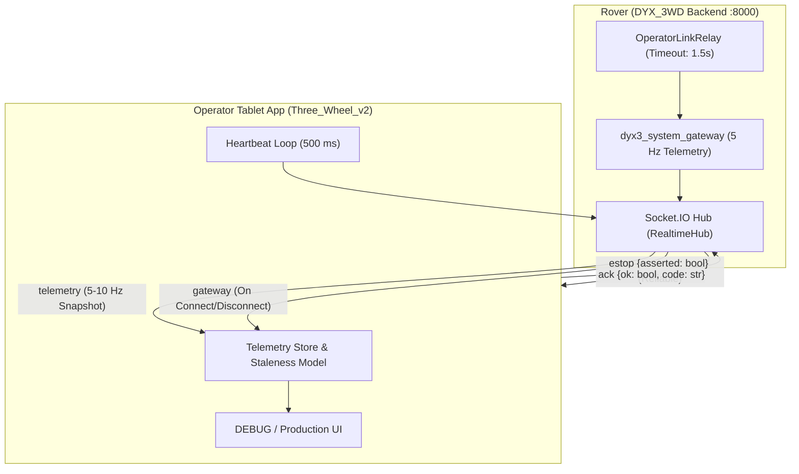
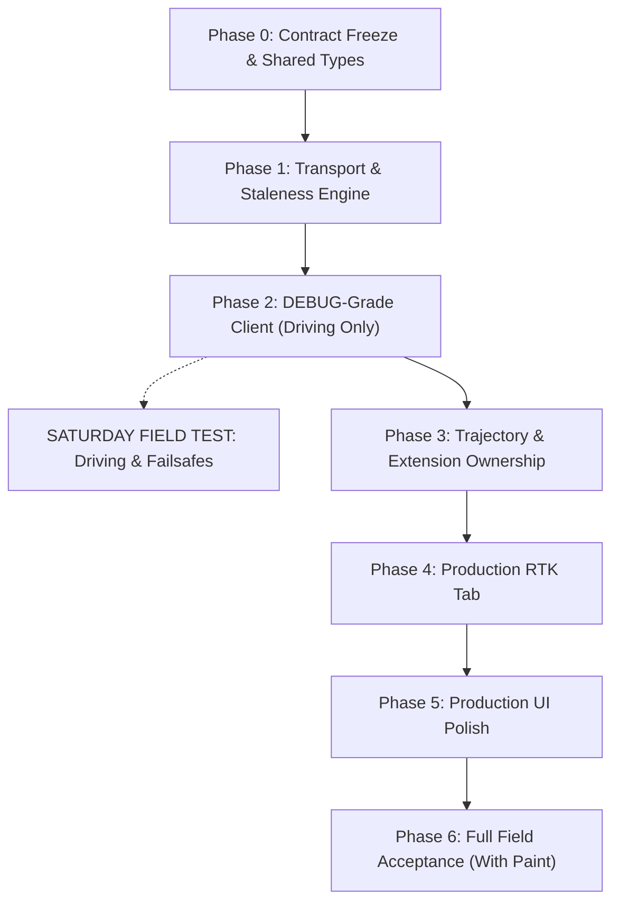

# Production Contract Upgrade Plan — Operator Client App (`Three_Wheel_v2`)

**Author:** Antigravity Engineering  
**Date:** 2026-10-08  
**Repository:** `Three_Wheel_v2`  
**Base Branch:** `origin/Runtime_Path` (commit `a0fba63`, 2026-08-20; local branch `agy/prod-contract-plan`)  
**Note on Branches:** `origin/App-Polish` has the most recent commit in the repository (`73afa4a`, 2026-09-07), but its commits diverged after `a120cb1` focusing exclusively on template screens and UI drag/scale/rotate fixes. The active RTK status management, NTRIP profile CRUD, and live-entry workflow live on `origin/Runtime_Path`. This upgrade plan is based on `origin/Runtime_Path`, and incorporates template requirements from `App-Polish`.  
**Target Backend:** `DYX_3WD` Production Stack (deployed revision `fbc7165` on branch `claude/cloud-phases`, with RTK API defined in `docs/plans/2026-10-08_production_rtk_plan.md` §17–19).

---

## Executive Summary & The Key Architectural Decision

The operator tablet client (`Three_Wheel_v2`) was designed and tested against the prototype rover stack (`PX4_DXP`). The rover has now transitioned to the high-reliability production ROS 2 Humble stack (`DYX_3WD`), where PX4 is reached via `dyx3_px4_link` in OFFBOARD mode, safety is enforced by `dyx3_motion_guard`, mission execution is governed by `dyx3_mission` and `dyx3_rpp`, and external communications pass strictly through `dyx3_system_gateway` and `dyx3_backend`.

### THE KEY DECISION FOR THE OWNER: Path and Trajectory Ownership

> [!IMPORTANT]
> **Owner Decision Required:** The client app owns path generation, collinearity thinning, and pre/post extensions. The production backend must not re-plan client geometry.

#### 1. The Overlap & Conflict
* **Current App Architecture:** The operator app is an interactive field CAD and mission planning station. It parses local DXF and surveyed CSVs, fits clothoids/arcs/lines, displays live overlay ghosts, allows operators to reverse and reorder segments, toggles spray on individual entities, attaches stencil templates (arrows, bike lanes, text), and calculates pre-run acceleration and post-run deceleration extensions. Crucially, the app performs Douglas-Peucker collinearity thinning (`collinearAwareMustHitIndices`) to declare `must_hit` vertices on true curves while omitting collinear interpolation points (preventing pure-pursuit lookahead collapse).
* **Current Backend Architecture:** The production backend currently carries a server-side `path_engine` ported verbatim from prototype `fc6436b`. Its `POST /api/missions` endpoint ingests raw DXF/CSV files, performs server-side TSP reordering (`optimize_segment_order`), re-fits curves, and synthesizes its own extensions before emitting a `DYX3PATH 1` artifact.
* **The Conflict:** If the app uploads a raw DXF/CSV to `POST /api/missions`, the rover re-plans the entire mission from scratch, silently discarding the operator's segment ordering, template placements, manual spray toggles, and carefully tuned pre/post extensions. In prototype field tests (recorded in `BACKEND_CHANGE_REQUEST_CSV_TRAJECTORY.md`), server-side re-planning caused 5 catastrophic field traps (merging two paint runs 50 m apart into one continuous mark, re-smoothing fitted arcs, and deleting deliberate double passes).

#### 2. The Agreed Contract Proposal
1. **What the App Sends:** An app-planned trajectory payload (`POST /api/missions/plan` or `POST /api/path/plan-trajectory`). The payload delivers ordered runs in **Local NED coordinates** (`[north_m, east_m]`), in SI units (metres, m/s), with:
   * Segment types explicitly categorized (`mark` vs `travel`).
   * Operator-ordered sequence preserved exactly.
   * Pre-marking acceleration runs (spray OFF) and post-marking run-outs (spray OFF) already computed and prepended/appended.
   * Per-point spray intent (`flags` bit 0).
   * Exact `must_hit_indices` declared by the app (`flags` bit 1) so RPP's downstream path conditioner never smooths away surveyed road corners or curve chords.
2. **What the Backend Validates:**
   * Frame sanity: Header specifies `frame: "local_ned"`.
   * Point sanity: Finite IEEE-754 numbers (no NaN/Inf), coordinates within bounding envelope (e.g. ±10,000 m of origin).
   * Geometry continuity: Maximum step distance between adjacent points, minimum 2 points per run.
   * Alternation invariant: Runs alternate `mark` ↔ `travel` (travel legs bridge disconnected mark spans).
3. **What the Backend Must NEVER Do:**
   * Never reorder segments (no TSP re-planning).
   * Never insert or delete transit legs.
   * Never re-fit or smooth curves (no fillet insertion or kink blending on app-planned geometry).
   * Never alter spray flags or drop coincident passes.
4. **Mission Identity & Staging:**
   * The backend compiles the validated app runs into a canonical `DYX3PATH 1` ASCII artifact (`points <N>`, `<north_m> <east_m> <flags>`).
   * The mission identity is **strictly the SHA-256 content hash** of the canonical `DYX3PATH 1` artifact: `artifact_id = sha256(file_bytes)`.
   * Both tablet and rover can compute this identical hash. The backend stores `/var/lib/dyx3/missions/<sha256>.dyx3path` idempotently.
   * The client verifies the resident mission via this 64-character hex hash before issuing `POST /api/missions/{sha}/start`.

---

## Section A: Inventory of Current App Contracts

The table below catalogs every network call found in the `Three_Wheel_v2` client source code (`src/` and `App.tsx`), including REST requests and Socket.IO events.

### A.1 REST Calls Inventory

| # | Endpoint / Path | Method | Source File:Line | Payload Shape (Request) | Response Shape | Screen / Workflow |
|---|---|---|---|---|---|---|
| 1 | `/api/auth/login` | `POST` | `src/api/authApi.ts:155` | `{"password": string}` | `{"token": string, "session_id": string, "expires_at": string, "ttl_s": number}` | Connection / Login screen |
| 2 | `/api/auth/logout` | `POST` | `src/api/authApi.ts:177` | none | `{}` | Settings / Disconnect |
| 3 | `/api/auth/change-password` | `POST` | `src/api/authApi.ts:189` | `{"current_password": string, "new_password": string}` | `{"token": string, "session_id": string, "expires_at": string, "ttl_s": number}` | Connection modal |
| 4 | `/api/ping` | `GET` | `App.tsx:4938`, `4962` | none | `{"status": string}` or 200 OK | Connection probe & subnet sweep |
| 5 | `/api/healthz` | `GET` | `App.tsx:2705`, `4962` | none | 200 OK | Connection probe & health check |
| 6 | `/api/discover` | `POST` | `App.tsx:5078` | none | `{"beacons": [{"id": str, "name": str, "host": str, "port": int, "version": str}]}` | Auto-discovery subnet scanner |
| 7 | `/api/arm` | `POST` | `App.tsx:4768` | `{"arm": boolean}` | `{"success": boolean, "message"?: string}` | TopHeader / Navbar Arm switch |
| 8 | `/api/set_mode` | `POST` | `App.tsx:4807`, `ModernHomeUI.tsx:1125` | `{"mode": "MANUAL"}` | `{"success": boolean, "message"?: string}` | Manual drive modal / Joystick open |
| 9 | `/api/estop` | `POST` | `App.tsx:4845` | none | `{"success": boolean}` | `FloatingEStop.tsx` (double-tap) |
| 10 | `/api/manual_control` | `POST` | `src/api/vehicleApi.ts:19` | `{"forward": number, "yaw": number}` | `{"success": boolean, "message": string}` | Legacy helper (unused in UI) |
| 11 | `/api/telemetry/latest` | `GET` | `src/api/missionApi.ts:206`, `App.tsx:2747` | none | Full `TelemetryData` JSON | Reconnect snapshot & Start entry pose |
| 12 | `/api/mission/status` | `GET` | `src/api/missionApi.ts:139` | none | `{"state": str, "rpp_state": int, "dist_to_goal": float, "speed": float, ...}` | Background status polling fallback |
| 13 | `/api/mission/loaded-path` | `GET` | `src/api/missionApi.ts:100`, `App.tsx:2751, 2824` | none | `LoadedPathResponse` (`loaded`, `mission_id`, `num_waypoints`, `num_mark`, `sample_coords`) | Resident mission verification gate |
| 14 | `/api/mission/load` | `POST` | `src/api/missionApi.ts:89`, `LeftSidebar.tsx:492` | `{"path_name"?: str, "mission_file"?: str}` | `{"loaded": str, "num_points": int}` | LeftSidebar Load button |
| 15 | `/api/mission/start` | `POST` | `src/api/missionApi.ts:107`, `LeftSidebar.tsx:531` | `{"mission_id"?: str, "path_name"?: str, "auto_origin"?: bool}` | `{"state": str, "message": str}` | Home / LeftSidebar Start mission |
| 16 | `/api/mission/stop` | `POST` | `src/api/missionApi.ts:111`, `LeftSidebar.tsx:523` | none | `{"success": boolean, "state": string}` | Home / LeftSidebar Stop mission |
| 17 | `/api/mission/pause` | `POST` | `src/api/missionApi.ts:123` | none | `{"success": boolean, "state": string}` | ModernHomeUI Pause button |
| 18 | `/api/mission/resume` | `POST` | `src/api/missionApi.ts:127` | none | `{"success": boolean, "state": string}` | ModernHomeUI Resume button |
| 19 | `/api/mission/abort` | `POST` | `src/api/missionApi.ts:115` | none | `{"success": boolean, "state": string}` | LeftSidebar / Home Abort |
| 20 | `/api/mission/clear` | `POST` | `src/api/missionApi.ts:119` | none | `{"cleared": boolean, "status": LoadedPathResponse}` | Reset resident controller path |
| 21 | `/api/mission/next` | `POST` | `src/api/missionApi.ts:131` | none | `{"success": boolean}` | Step point advance |
| 22 | `/api/mission/export` | `POST` | `src/api/missionApi.ts:135` | none | file / text | Mission data export |
| 23 | `/api/paths` | `GET` | `src/api/pathApi.ts:129`, `App.tsx:2385` | none | `PathListItem[]` (`[{"name": str, "num_points"?: int}]`) | Fields file selector / LeftSidebar |
| 24 | `/api/path/{name}/preview` | `GET` | `src/api/pathApi.ts:144`, `App.tsx:2427` | none | `PathPreviewResponse` (`bounds`, `waypoints`) | Plan preview on map |
| 25 | `/api/path/{name}/entities` | `GET` | `src/api/pathApi.ts:137`, `App.tsx:2441` | none | `DXFEntitiesResponse` (`entities: [...]`) | Fields DXF entity inspector |
| 26 | `/api/path/{name}/entities` | `POST` | `src/api/pathApi.ts:195` | `{"overrides": [{"entity_id": str, "is_mark": bool}]}` | `{"ok": boolean}` | Per-entity spray override |
| 27 | `/api/path/{name}/entities/order` | `POST` | `src/api/pathApi.ts:203` | `{"entity_order": string[]}` | `{"ok": boolean}` | Save manual entity driving order |
| 28 | `/api/path/{name}/segments` | `GET` | `src/api/pathApi.ts:241` | none | `PathSegmentsResponse` (`segments`, `mark_length_m`) | Pre-stage segment verification |
| 29 | `/api/path/{name}/align` | `POST` | `src/api/pathApi.ts:211` | `{"ref_points": [...], "origin_gps": [lat, lon], "rotation_deg": float}` | `{"success": boolean}` | Fields 2-point GPS alignment |
| 30 | `/api/path/{name}/line-config` | `GET` | `src/api/pathApi.ts:294` | none | `SurveyLineConfigResponse` | Corner fillet / arc fit config |
| 31 | `/api/path/{name}/line-config` | `POST` | `src/api/pathApi.ts:290` | `{"fillet_corners_m": float, "fit_arcs_max_dev_m": float}` | `{"ok": boolean}` | Corner fillet / arc fit config save |
| 32 | `/api/path/{name}/plan-and-stage` | `POST` | `src/api/pathApi.ts:264` | `PlanAndStageRequest` (`source`, `ref_points`, `origin_gps`) | `PathPlanResponse` (`mission_id`, `warnings`) | Prototype Stage orchestrator |
| 33 | `/api/path/staged/{id}` | `GET` | `src/api/pathApi.ts:268`, `missionApi.ts:174` | none | `StagedMissionResponse` (`mission_id`, `waypoints`, `spray_flags`) | Staged mission gate inspection |
| 34 | `/api/path/load-to-controller` | `POST` | `src/api/pathApi.ts:96` | `{"mission_id": string}` | `{"success": boolean, "mission_id": string}` | Stage 10 controller load |
| 35 | `/api/path/plan-trajectory` | `POST` | `src/api/planTrajectory.ts:275` | `PlanTrajectoryRequest` (`mission_name`, `origin_gps`, `runs`, `speeds`, `spray_mode`) | `PlanTrajectoryResponse` (`mission_id`, `run_echo`, `mark_length_m`, `transit_length_m`) | CSV / Template app-planned trajectory |
| 36 | `/api/path/upload` | `POST` | `src/api/pathApi.ts:184`, `LeftSidebar.tsx:604` | `FormData` (`file`) | `{"name": string, "uploaded": boolean}` | LeftSidebar export upload |
| 37 | `/api/path/parse-dxf` | `POST` | `src/api/pathApi.ts:155`, `TemplatesPage.tsx:1010`, `TemplatePanel.tsx:339` | `FormData` (`file`) | DXF preview coordinates | Template import fallback |
| 38 | `/api/path/parse-point-csv` | `POST` | `src/api/pathApi.ts:166` | `FormData` (`file`) | CSV coordinates | Deprecated in UI (app parses locally) |
| 39 | `/api/path/parse-point-gps-csv` | `POST` | `src/api/pathApi.ts:177` | `FormData` (`file`) | CSV coordinates | Deprecated in UI (app parses locally) |
| 40 | `/api/path/plan` | `POST` | `src/api/pathApi.ts:207` | `PathPlanRequest` | `PathPlanResponse` | Prototype server planner |
| 41 | `/api/path/{name}` | `DELETE` | `src/api/pathApi.ts:275` | none | `{"deleted": boolean}` | Delete file from rover storage |
| 42 | `/api/path/{name}/spray-mode/continuous` | `PUT` | `App.tsx:5847`, `ModernSettingsPage.tsx:485` | `{}` | `{"ok": boolean}` | Path spray mode selector |
| 43 | `/api/path/{name}/spray-mode/dash` | `PUT` | `App.tsx:5855`, `ModernSettingsPage.tsx:491` | `{"dash_on_distance_m": float, "dash_off_distance_m": float}` | `{"ok": boolean}` | Dash spray mode parameters |
| 44 | `/api/path/{name}/spray-mode/point` | `PUT` | `App.tsx:5867`, `ModernSettingsPage.tsx:501` | `{"point_execution_mode": string}` | `{"ok": boolean}` | Point spray mode parameters |
| 45 | `/api/rtk/status` | `GET` | `src/api/rtkStatus.ts:123`, `App.tsx:4517` | none | `RTKStatus` (`mode`, `running`, `healthy`, `source_state`, `frames`, `bytes`, `last_frame_age_s`) | RTK status poll in App.tsx |
| 46 | `/api/rtk/lora/start` | `POST` | `App.tsx:4451` | `{"baudrate": 115200, "serial_port": "/dev/ttyUSB0"}` | `RTKStatus` | Positioning / Home LoRa start |
| 47 | `/api/rtk/stop` | `POST` | `App.tsx:4489` | none | `RTKStatus` | Positioning / Home RTK stop |
| 48 | `/api/rtk/profiles` | `GET` | `src/api/rtkProfiles.ts:146` | none | `NtripProfileRegistry` (`schema_version`, `registry_revision`, `profiles`) | Settings RTK NTRIP tab |
| 49 | `/api/rtk/profiles` | `POST` | `src/api/rtkProfiles.ts:161` | `NtripProfileCreateInput` (`name`, `host`, `port`, `mountpoint`, `username`, `password`), `If-Match` | `{"ok": boolean}` | Create NTRIP profile |
| 50 | `/api/rtk/profiles/{id}` | `PATCH` | `src/api/rtkProfiles.ts:193` | `NtripProfileUpdateInput`, `If-Match` | `{"ok": boolean}` | Edit NTRIP profile |
| 51 | `/api/rtk/profiles/{id}` | `DELETE` | `src/api/rtkProfiles.ts:210` | `If-Match` | `{"ok": boolean}` | Delete NTRIP profile |
| 52 | `/api/rtk/profiles/{id}/default` | `PUT` | `src/api/rtkProfiles.ts:226` | `If-Match` | `{"ok": boolean}` | Set default NTRIP profile |
| 53 | `/api/rpp/params` | `GET` | `src/api/controllerParams.ts:172` | none | `ControllerParamListResponse` (`parameters: [...]`) | Settings Controller tab |
| 54 | `/api/rpp/params` | `PUT` | `src/api/controllerParams.ts:259` | `{"parameters": Record<string, ParamValue>}` | `{"ok": boolean, "parameters": Record<string, boolean>}` | Save RPP controller tunables |
| 55 | `/api/spray/params` | `GET` | `src/api/controllerParams.ts:172`, `SecondaryPages.tsx:157, 231` | none | `ControllerParamListResponse` (`parameters: [...]`) | Settings Spray tab |
| 56 | `/api/spray/params` | `PUT` | `src/api/controllerParams.ts:259`, `SecondaryPages.tsx:272, 385` | `{"parameters": Record<string, ParamValue>}` | `{"ok": boolean, "parameters": Record<string, boolean>}` | Save spray valve timings |
| 57 | `/api/spray/status` | `GET` | `SecondaryPages.tsx:206`, `ModernSettingsPage.tsx:401` | none | `{"enabled": bool, "spraying": bool, "manual_override": bool}` | Settings spray status poll |
| 58 | `/api/spray/enable` | `POST` | `App.tsx:5889`, `ModernSettingsPage.tsx:429` | none | `{"enabled": boolean}` | Master spray enable |
| 59 | `/api/spray/disable` | `POST` | `App.tsx:5889`, `ModernSettingsPage.tsx:429` | none | `{"enabled": boolean}` | Master spray disable |
| 60 | `/api/spray/on` | `POST` | `SecondaryPages.tsx:293, 298`, `ModernSettingsPage.tsx:456, 523` | none | `{"success": boolean}` | Manual spray ON / Hold heartbeat |
| 61 | `/api/spray/off` | `POST` | `SecondaryPages.tsx:312`, `ModernSettingsPage.tsx:456, 545` | none | `{"success": boolean}` | Manual spray OFF |
| 62 | `/api/spray/test` | `POST` | `SecondaryPages.tsx:330` | `{"on": boolean, "duration_s": number}` | `{"success": boolean}` | Timed spray purge pulse |

### A.2 Socket.IO Events Inventory

| # | Event Name | Direction | Source File:Line | Payload Shape | Screen / Subsystem |
|---|---|---|---|---|---|
| 1 | `connect` | App → Srv | `App.tsx:1961` | `auth: {"token": string}` (handshake payload) | Connection screen |
| 2 | `connect` | Srv → App | `src/utils/socketConnect.ts:31` | none | Connection screen |
| 3 | `connect_error` | Srv → App | `src/utils/socketConnect.ts:32` | `Error` | Connection screen |
| 4 | `disconnect` | Srv → App | `App.tsx:1967`, `useVirtualJoystick.ts:785` | `reason: string` | Global banner / Joystick safety |
| 5 | `error` | Srv → App | `App.tsx:1975` | `err: unknown` | Global logging |
| 6 | `auth_revoked` | Srv → App | `App.tsx:1971` | `{"reason": string}` | Kick-to-login handler |
| 7 | `telemetry` | Srv → App | `App.tsx:1979` | Full flat `TelemetrySnapshot` (10 Hz) | Global HUD, MapView, TelemetryDashboard |
| 8 | `mission_status` | Srv → App | `App.tsx:2020` | `{"state": string, "rpp_state": int, "xtrack": float, ...}` | Home / LeftSidebar mission state badge |
| 9 | `joystick_acquire` | App → Srv | `src/hooks/useVirtualJoystick.ts:618` | `{"auth": str, "session_id": str, "client_monotonic_ms": number}` | Manual joystick overlay |
| 10 | `joystick_acquired`| Srv → App | `src/hooks/useVirtualJoystick.ts:781` | `{"type": "joystick_acquired", "lease_id": str, "command_rate_hz": int, ...}` | Joystick activation |
| 11 | `joystick_command` | App → Srv | `src/hooks/useVirtualJoystick.ts:294` | `{"auth": str, "session_id": str, "lease_id": str, "sequence": int, "deadman": bool, "throttle": float, "steering": float}` | 10–20 Hz joystick driving loop |
| 12 | `joystick_release` | App → Srv | `src/hooks/useVirtualJoystick.ts:363, 651`| `{"auth": str, "session_id": str, "lease_id": str}` | Joystick panel close / E-stop |
| 13 | `joystick_released`| Srv → App | `src/hooks/useVirtualJoystick.ts:783` | `{"type": "joystick_released", "state": "inactive", "reason": str}` | Joystick teardown |
| 14 | `joystick_error` | Srv → App | `src/hooks/useVirtualJoystick.ts:782` | `{"type": "joystick_error", "code": str, "message": str}` | Joystick error toast / alert |
| 15 | `socket_error` | Srv → App | `src/hooks/useVirtualJoystick.ts:784` | `{"reason": "unauthorised"}` | Auth failure teardown |

---

## Section B: Prototype to Production Mapping Table

Status legend:
* **`SAME`**: Endpoint exists with identical URL, HTTP method, and semantically identical payload.
* **`RENAMED`**: Endpoint exists in production under a cleaner path; payload is identical or minimal change.
* **`CHANGED-SHAPE`**: Endpoint exists, but URL, method, or payload schema/semantics changed.
* **`MISSING-ON-ROVER`**: Feature is required by the client app, but the production backend does not currently implement it.
* **`DROPPED-BY-DESIGN`**: Production stack deliberately omits this endpoint based on architectural principles.

| # | Prototype Endpoint / Event | Production Equivalent | Status | Architectural Rationale & Transition Notes |
|---|---|---|---|---|
| 1 | `POST /api/auth/login` | None (`Bearer <token>`) | **DROPPED-BY-DESIGN** | `docs/contracts/backend.md §2`: Auth uses static pre-provisioned Bearer tokens stored hashed on Jetson (`/var/lib/dyx3/state/auth.json`). Passwords/login endpoints are omitted to eliminate mutable session state. Tablet securely stores the provisioned token. |
| 2 | `POST /api/auth/logout` | None (Client-side token drop) | **DROPPED-BY-DESIGN** | Static Bearer tokens are stateless on the rover; client simply discards the token locally. |
| 3 | `POST /api/auth/change-password` | None | **DROPPED-BY-DESIGN** | Passwords are not maintained by the backend. Credentials on the rover are operator-provisioned CLI tokens (`python -m dyx3_backend.auth.tokens create`). |
| 4 | `GET /api/ping` | `GET /api/ping` | **SAME** | Liveness check of backend process. Returns `{"status": "ok"}`. |
| 5 | `GET /api/healthz` | `GET /api/health` | **CHANGED-SHAPE** | Renamed from `/api/healthz` to `/api/health`. Returns `{backend: "ok", gateway_connected: bool, telemetry_age_s: float, telemetry_fresh: bool, tablet_heartbeat_age_s: float, tablet_alive: bool}`. Requires `Viewer` role. |
| 6 | `POST /api/discover` | `POST /api/discover` | **MISSING-ON-ROVER** | Subnet sweep discovery beacon is missing in production backend (`dyx3_backend`). Tablet currently relies on manual IP entry or scanning port 8000. |
| 7 | `POST /api/arm` | `POST /api/vehicle/arm` | **RENAMED** | Renamed to `/api/vehicle/arm`. Request body is identical: `{"arm": boolean}`. Requires `Operator` role. Auth header changed from `X-Rover-Token` to `Authorization: Bearer <token>`. |
| 8 | `POST /api/set_mode` | `POST /api/vehicle/offboard` | **CHANGED-SHAPE** | `CLAUDE.md §10 & §12`: Direct PX4 flight mode changes (`MANUAL`, `HOLD`, `STABILIZED`) are dropped. PX4 is commanded exclusively in `OFFBOARD` mode via `dyx3_px4_link`. Rover backend exposes `POST /api/vehicle/offboard` with `{"enable": boolean}`. |
| 9 | `POST /api/estop` | `POST /api/estop` | **CHANGED-SHAPE** | Body now requires `{"asserted": boolean}`. Contract rule: asserting (`asserted: true`) allowed for any authenticated role (`Viewer` or `Operator`); clearing (`asserted: false`) requires `Operator` role. |
| 10 | `POST /api/manual_control` | `POST /api/manual_drive` (Proposed) | **MISSING-ON-ROVER** | Prototype had unused REST manual control. Production backend has no manual drive endpoint. `docs/contracts/backend.md §5` notes manual drive is not ported and needs an explicit contract. |
| 11 | `None` (Tablet Heartbeat) | `POST /api/heartbeat` & Socket `heartbeat` | **MISSING-ON-APP** | **CRITICAL PRODUCTION SAFETY REQUIREMENT:** `backend.md §3` & `dyx3_system_gateway.md §4`. Tablet must send heartbeat every 500 ms (timeout 1.5 s). If lost, `dyx3_motion_guard` stops the rover. |
| 12 | `GET /api/telemetry/latest` | `GET /api/telemetry` | **CHANGED-SHAPE** | Renamed to `/api/telemetry`. Returns structured gateway snapshot: `{"connected": bool, "age_s": float, "snapshot": {...}}`. Coordinates in NED metres, angles in radians (`[-pi, pi]`). |
| 13 | `GET /api/mission/status` | `GET /api/telemetry` | **DROPPED-BY-DESIGN** | Distinct mission status REST polling is redundant; mission FSM state is embedded in the telemetry snapshot under `snapshot.mission`. |
| 14 | `GET /api/mission/loaded-path` | `GET /api/missions/{sha}/path` | **CHANGED-SHAPE** | In production, mission identity is the 64-character SHA-256 hash. `snapshot.mission.path_artifact_sha256` indicates the active mission, and `GET /api/missions/{sha}/path` returns its points. |
| 15 | `POST /api/mission/load` | None (Load happens at start) | **DROPPED-BY-DESIGN** | In production, there is no two-step "load to disk then load to memory" step for files. Starting a mission by SHA (`POST /api/missions/{sha}/start`) triggers atomic load and execution admission. |
| 16 | `POST /api/path/load-to-controller` | `POST /api/missions/{sha}/start` | **DROPPED-BY-DESIGN** | Merged into `POST /api/missions/{sha}/start`. `dyx3_mission` loads the artifact directly from `/var/lib/dyx3/missions/<sha256>.dyx3path`. |
| 17 | `POST /api/mission/start` | `POST /api/missions/{sha}/start` | **CHANGED-SHAPE** | Changed from file-name/body based start to content-addressed start: `POST /api/missions/{sha}/start`. Filename fallbacks and `auto_origin` are eliminated; origin is georeferenced in artifact. |
| 18 | `POST /api/mission/stop` | `POST /api/mission/abort` | **MISSING-ON-ROVER** | Production backend implements `/api/mission/abort`, `/api/mission/pause`, and `/api/mission/resume`, but lacks `/api/mission/stop` (smooth stop without marking as aborted). |
| 19 | `POST /api/mission/pause` | `POST /api/mission/pause` | **SAME** | Method POST, no body. Requires `Operator` role. |
| 20 | `POST /api/mission/resume` | `POST /api/mission/resume` | **SAME** | Method POST, no body. Requires `Operator` role. |
| 21 | `POST /api/mission/abort` | `POST /api/mission/abort` | **CHANGED-SHAPE** | Method POST. Now accepts optional JSON body: `{"reason": "operator" \| "safety" \| "unspecified"}`. |
| 22 | `POST /api/mission/clear` | `POST /api/mission/clear` (Proposed) | **MISSING-ON-ROVER** | Production backend lacks an endpoint to clear resident mission memory without triggering an abort state. |
| 23 | `POST /api/mission/next` | `POST /api/mission/skip_point` | **RENAMED** | Renamed from `/api/mission/next` to `/api/mission/skip_point`. Advances controller past the current waypoint. |
| 24 | `POST /api/mission/export` | `GET /api/runs/{run_id}` | **CHANGED-SHAPE** | Exporting runs is now handled by querying the recorder: `GET /api/runs` and `GET /api/runs/{id}` (reads `/var/lib/dyx3/runs`). |
| 25 | `POST /api/path/upload` | `POST /api/missions` | **CHANGED-SHAPE** | Multipart file upload (`.dxf`, `.csv`, `.waypoints`) creates a `DYX3PATH 1` artifact by running server-side `path_engine`. Returns `{"ok": true, "mission": {...}}` with SHA-256. |
| 26 | `GET /api/paths` | `GET /api/missions` | **CHANGED-SHAPE** | Lists stored missions from `/var/lib/dyx3/missions`. Returns `{"missions": [{"sha256": str, "source_filename": str, "num_points": int, ...}]}`. |
| 27 | `GET /api/path/{name}/preview` | `GET /api/missions/{sha}/path` | **CHANGED-SHAPE** | Returns `{sha256: str, frame: "local_ned", points: [[north_m, east_m, flags], ...]}`. |
| 28 | `GET /api/path/{name}/entities` | None | **DROPPED-BY-DESIGN** | Rover no longer hosts raw DXF entity sidecars. Parsing and entity visualization are performed locally inside the app. |
| 29 | `POST /api/path/{name}/entities` | None | **DROPPED-BY-DESIGN** | Entity spray overrides are applied client-side when the app plans trajectory runs. |
| 30 | `POST /api/path/{name}/entities/order` | None | **DROPPED-BY-DESIGN** | Entity ordering is performed client-side during trajectory generation. |
| 31 | `POST /api/path/{name}/align` | None | **DROPPED-BY-DESIGN** | 2-point reference alignment and transformation are performed locally in the app prior to trajectory generation. |
| 32 | `GET /api/path/{name}/segments` | None | **DROPPED-BY-DESIGN** | Server-side segment verification is replaced by `run_echo` validation during trajectory staging. |
| 33 | `POST /api/path/{name}/plan-and-stage` | None | **DROPPED-BY-DESIGN** | Replaced by direct app trajectory staging (`POST /api/missions/plan` or `POST /api/path/plan-trajectory`). |
| 34 | `GET /api/path/staged/{id}` | `GET /api/missions/{sha}` | **CHANGED-SHAPE** | Staged mission inspection uses artifact SHA-256: `GET /api/missions/{sha}`. |
| 35 | `DELETE /api/path/{name}` | None (`DELETE /api/missions/{sha}`) | **MISSING-ON-ROVER** | Production backend does not currently implement artifact deletion/pruning (`backend.md §5`). |
| 36 | `POST /api/path/{name}/line-config` | None | **DROPPED-BY-DESIGN** | Corner fillet and arc fitting are performed locally in the app during trajectory assembly. |
| 37 | `GET /api/path/{name}/line-config` | None | **DROPPED-BY-DESIGN** | Same as above. |
| 38 | `POST /api/path/plan-trajectory` | `POST /api/missions/plan` (Proposed) | **MISSING-ON-ROVER** | **THE KEY GAP:** Production backend only supports file upload (`POST /api/missions`), which forces server-side planning. Backend needs an endpoint to accept app-planned NED runs and emit a `DYX3PATH 1` artifact. |
| 39 | `PUT /api/path/{name}/spray-mode/*` | None (Compiled into artifact) | **DROPPED-BY-DESIGN** | Spray mode (continuous, dash, point) is compiled directly into the path artifact points (`flags` bit 0). `dyx3_spray` follows artifact flags. |
| 40 | `POST /api/path/parse-dxf` | None (Local in app) | **DROPPED-BY-DESIGN** | DXF parsing for preview/templates is executed locally using `dxfLocalImport.ts`. |
| 41 | `POST /api/path/parse-point-csv` | None (Local in app) | **DROPPED-BY-DESIGN** | CSV parsing is executed locally using `localPointCsv.ts`. |
| 42 | `POST /api/path/parse-point-gps-csv` | None (Local in app) | **DROPPED-BY-DESIGN** | Same as above. |
| 43 | `POST /api/path/plan` | None | **DROPPED-BY-DESIGN** | Legacy planner endpoint eliminated. |
| 44 | `GET /api/rtk/status` | `GET /api/rtk/status` | **CHANGED-SHAPE** | Production RTK plan (§17) defines a unified, rich status object with `overall`, `source`, `transport`, `receiver`, and `counters`. Replaces prototype's simple status dict. |
| 45 | `POST /api/rtk/lora/start` | `PUT /api/rtk/source` + `POST /api/rtk/start` | **CHANGED-SHAPE** | Production RTK plan (§17) decouples source selection (`PUT /api/rtk/source` with `{"source": "LORA"}`) from worker execution (`POST /api/rtk/start`). |
| 46 | `POST /api/rtk/stop` | `POST /api/rtk/stop` | **SAME** | Stops RTK worker process. Returns updated status. |
| 47 | `GET /api/rtk/profiles` | `GET /api/rtk/profiles` | **SAME** | Lists NTRIP profiles. Password field write-only (never returned). |
| 48 | `POST /api/rtk/profiles` | `POST /api/rtk/profiles` | **SAME** | Creates NTRIP profile. |
| 49 | `PATCH /api/rtk/profiles/{id}` | `PATCH /api/rtk/profiles/{id}` | **SAME** | Updates NTRIP profile. |
| 50 | `DELETE /api/rtk/profiles/{id}` | `DELETE /api/rtk/profiles/{id}` | **SAME** | Deletes NTRIP profile. |
| 51 | `PUT /api/rtk/profiles/{id}/default` | `PUT /api/rtk/config` (active profile) | **CHANGED-SHAPE** | Profile selection is handled via RTK configuration update (`PUT /api/rtk/config` or `PUT /api/rtk/source`). |
| 52 | `None` (RTK Transport Selection) | `GET/PUT /api/rtk/transport` | **NEW CONTRACT** | Plan §17: Selectable transport (`USB_DIRECT` vs `PX4_DDS`). |
| 53 | `None` (RTK Serial Port List) | `GET /api/rtk/serial-ports` | **NEW CONTRACT** | Plan §17: Lists available serial ports (`/dev/serial/by-id/...`) for LoRa and GNSS USB direct. |
| 54 | `GET /api/rpp/params` | `GET /api/rpp/params` (Proposed) | **MISSING-ON-ROVER** | In production, RPP is a C++ node (`dyx3_rpp`). Tuning parameters exist in ROS 2, but backend has no REST interface to query them. |
| 55 | `PUT /api/rpp/params` | `PUT /api/rpp/params` (Proposed) | **MISSING-ON-ROVER** | Backend has no REST interface to update RPP parameters. |
| 56 | `GET /api/spray/params` | `GET /api/spray/params` (Proposed) | **MISSING-ON-ROVER** | `dyx3_spray` tuning parameters (solenoid delay, nozzle offsets) exist in ROS 2, but backend has no REST interface. |
| 57 | `PUT /api/spray/params` | `PUT /api/spray/params` (Proposed) | **MISSING-ON-ROVER** | Backend has no REST interface to update spray parameters. |
| 58 | `GET /api/spray/status` | `GET /api/telemetry` (`snapshot.spray`) | **DROPPED-BY-DESIGN** | Spray status is streamed continuously in `telemetry.snapshot.spray`. |
| 59 | `POST /api/spray/enable` / `/disable` | `PUT /api/spray/config` (Proposed) | **MISSING-ON-ROVER** | Master spray enable is governed by `dyx3_spray` parameter `spray_enabled`. No direct REST toggle exists. |
| 60 | `POST /api/spray/on` / `/off` | `POST /api/spray/manual` | **CHANGED-SHAPE** | Replaced by `POST /api/spray/manual` with `{"on": boolean}`. Requires `Operator` role. |
| 61 | `POST /api/spray/test` | `POST /api/spray/test` (Proposed) | **MISSING-ON-ROVER** | Purge pulse test endpoint is missing in production backend. |
| 62 | `GET/POST /api/params/{name}` | None | **DROPPED-BY-DESIGN** | `CLAUDE.md §10 & §12`: Direct PX4 parameter access via app is prohibited. PX4 parameters are managed via version-controlled `.params` files on Jetson. |
| 63 | Socket: `auth: {token}` | Socket: `auth: {"token": str}` | **SAME** | Handshake authentication during Socket.IO connection. Token verified against `auth.json`. |
| 64 | Socket: `auth_revoked` | None (Handled via disconnect) | **DROPPED-BY-DESIGN** | Invalidated token simply results in immediate server-initiated socket disconnect. |
| 65 | Socket: `telemetry` | Socket: `telemetry` | **CHANGED-SHAPE** | Emits `{"snapshot": {...}, "age_s": float}` at 5–10 Hz instead of flat dict. Angles in radians. |
| 66 | Socket: `mission_status` | Embedded in `telemetry` | **DROPPED-BY-DESIGN** | Separate `mission_status` socket event dropped; `snapshot.mission` carries the authoritative state. |
| 67 | Socket: `joystick_acquire` | Socket: `joystick_acquire` (Proposed) | **MISSING-ON-ROVER** | Production backend has no virtual joystick subsystem. Must be implemented via gateway. |
| 68 | Socket: `joystick_command` | Socket: `joystick_command` (Proposed) | **MISSING-ON-ROVER** | Production backend has no virtual joystick command handler. |
| 69 | Socket: `joystick_release` | Socket: `joystick_release` (Proposed) | **MISSING-ON-ROVER** | Production backend has no virtual joystick release handler. |
| 70 | Socket: `heartbeat` | Socket: `heartbeat` | **NEW CONTRACT** | Bidirectional or client-push heartbeat event matching `POST /api/heartbeat`. |
| 71 | Socket: `estop` | Socket: `estop` | **CHANGED-SHAPE** | Client emits `estop` with `{"asserted": boolean}`. Ack returns verdict `{ok: bool, code: str, reason: str}`. |

---

## Section C: Rover-Side Gap List

This section details all functionality required by the client app that is currently missing on the production rover backend, categorized by priority and owning package (per `CLAUDE.md §6`).

### C.1 Priority Classification
* **P0 (Mandatory for Field Test This Saturday):** Driving-only, debug-grade observability, motion safety, and telemetry.
* **P1 (Mandatory for Production Client):** Full mission planning flow, RTK control tab, autonomous spray execution.
* **P2 (Maintenance & Advanced Tooling):** Parameter dial editors, bag downloads, log exports.

### C.2 Gap Items Table

| ID | Endpoint / Event | Purpose | Owning Package | Priority | Dependencies & Contract Details |
|---|---|---|---|---|---|
| **GAP-01** | `POST /api/heartbeat` & Socket `heartbeat` | Keep operator link alive. Tablet heartbeat is safety-critical; without it rover stops after 1.5 s. | `backend/`, `dyx3_system_gateway/` | **P0** | Already implemented in `fbc7165` backend! Must be wired into client app transport loop immediately. |
| **GAP-02** | `POST /api/vehicle/offboard` | Command rover into/out of OFFBOARD mode so it can accept drive setpoints. | `backend/`, `dyx3_system_gateway/`, `dyx3_px4_link/` | **P0** | Already implemented in `fbc7165` (`{"enable": bool}`). Client UI must wire to this instead of `/api/set_mode`. |
| **GAP-03** | `POST /api/estop` | Emergency stop assertion (`asserted: true`) and operator clear (`asserted: false`). | `backend/`, `dyx3_motion_guard/` | **P0** | Implemented in `fbc7165`. Client app payload must change from empty body to `{"asserted": bool}`. |
| **GAP-04** | `POST /api/missions/plan` (or `/api/path/plan-trajectory`) | **Ingest app-planned trajectory.** Accepts NED runs with pre/post extensions and must-hit flags; returns `DYX3PATH 1` SHA-256. | `backend/` (`mission/service.py`) | **P0** (or use pre-staged mission for Sat) | **THE KEY GAP.** Backend must create `DYX3PATH 1` without running server-side TSP/extension re-planning. |
| **GAP-05** | `POST /api/mission/stop` | Graceful mission stop (decelerates to 0 m/s without triggering an ABORT error). | `backend/`, `dyx3_mission/` | **P0** | Production currently only has `pause` and `abort`. Need clean stop to finish runs. |
| **GAP-06** | `GET /api/rtk/status` & REST controls | Expose RTK status, source selection (`PUT /api/rtk/source`), and start/stop per plan.md §17. | `backend/` (`rtk/`), `dyx3_gnss_rtk/` | **P0** (status) / **P1** (full CRUD) | Branch `codex/rtk-production` is building this now. P0 requires `status` in telemetry snapshot. |
| **GAP-07** | Socket.IO / REST Manual Drive | Virtual joystick manual driving (leaser/command loop) for positioning rover before start. | `backend/`, `dyx3_system_gateway/`, `dyx3_motion_guard/` | **P1** (for Saturday: physical RC / pre-positioning used) | Requires a dedicated ROS 2 motion setpoint source in `motion_guard` with watchdog timeout. |
| **GAP-08** | `POST /api/spray/manual` | Manual bench testing of spray valve (`{"on": bool}`). | `backend/`, `dyx3_spray/` | **P1** (Paint not needed Saturday) | Implemented in `fbc7165` via gateway `SetSprayManual`. Client needs to point manual toggle here. |
| **GAP-09** | `POST /api/spray/test` | Purge/timed spray test pulse (`{"duration_s": float}`). | `backend/`, `dyx3_spray/` | **P1** | Backend timer or gateway command to open valve for N seconds. |
| **GAP-10** | `GET/PUT /api/rpp/params` | Read/write RPP tuning parameters for field engineering tuning. | `backend/`, `dyx3_rpp/` | **P1** (Debug client) / **P2** (Prod) | Gateway bridge to ROS 2 parameter service for `dyx3_rpp`. |
| **GAP-11** | `GET/PUT /api/spray/params` | Read/write spray tuning parameters (solenoid delay, nozzle offsets). | `backend/`, `dyx3_spray/` | **P1** (Debug client) / **P2** (Prod) | Gateway bridge to ROS 2 parameter service for `dyx3_spray`. |
| **GAP-12** | `POST /api/discover` | Local Wi-Fi subnet sweep discovery beacon. | `backend/` | **P2** | Lightweight UDP broadcast or HTTP sweep response with hostname and machine ID. |
| **GAP-13** | Run & MCAP Log Download | Download raw recorded bags/logs from `/var/lib/dyx3/runs` directly to tablet. | `backend/`, `dyx3_recorder/` | **P2** | Static file streaming endpoint for `.mcap` and `.ulg` files. |

---

## Section D: Realtime Contract Proposal

### D.1 Protocol & Versioning
* **Transport:** Socket.IO v4 over WebSocket (`transports: ["websocket"]`). Polling fallback is explicitly disabled in APK builds due to Android network buffer stalls.
* **Authentication:** Handshake `auth: {"token": "<bearer_token>"}`. Tokens verified against hashed store in constant time.
* **Envelope Versioning:** Every event envelope carries a version field `"v": 1`.

### D.2 Event Specifications



#### 1. `telemetry` (Server → Client)
* **Nature:** Snapshot (Loss-tolerant, stateful replacement).
* **Rate:** 5 Hz (default from gateway) to 10 Hz.
* **Stale Threshold:** 1.0 s.
* **Disconnect Threshold:** 2.5 s.
* **Payload Schema (`v: 1`):**
```json
{
  "v": 1,
  "age_s": 0.042,
  "snapshot": {
    "vehicle_state": {
      "pos_n": 12.453,
      "pos_e": 45.120,
      "pos_d": -0.012,
      "heading_rad": 1.570796,
      "speed_m_s": 0.350,
      "yaw_rate_rad_s": 0.002,
      "armed": true,
      "nav_state": "OFFBOARD",
      "age_s": 0.020,
      "fresh": true
    },
    "rtk": {
      "overall": {
        "state": "RUNNING",
        "healthy": true,
        "fix_type": "RTK_FIXED",
        "fix_type_int": 6,
        "hrms_m": 0.014,
        "vrms_m": 0.021,
        "satellites": 24,
        "corrections_age_s": 0.4
      },
      "source": {
        "selected": "NTRIP",
        "connected": true,
        "state": "STREAMING",
        "bytes_rx": 1420580,
        "crc_failures": 0,
        "rate_hz": 1.0,
        "profile_name": "Office_Base"
      },
      "transport": {
        "selected": "USB_DIRECT",
        "ready": true,
        "bytes_injected": 1420580,
        "port": "/dev/serial/by-id/usb-Unicore_UM982-if00"
      }
    },
    "mission": {
      "state": "RUNNING",
      "path_artifact_sha256": "4b0e669e4871e808...",
      "current_point_index": 142,
      "total_points": 850,
      "dist_to_goal_m": 24.8,
      "xtrack_m": 0.012,
      "heading_error_rad": 0.008
    },
    "motion_guard": {
      "motion_allowed": true,
      "e_stop_asserted": false,
      "safety_gate_passed": true,
      "reason_code": "OK"
    },
    "operator_link": {
      "alive": true,
      "heartbeat_age_s": 0.25
    },
    "spray": {
      "state": "SPRAYING",
      "valve_open": true,
      "manual_override": false,
      "watchdog_alive": true
    }
  }
}
```

#### 2. `heartbeat` (Client → Server)
* **Nature:** Keepalive Ping / Safety Pulse.
* **Rate:** 2 Hz (every 500 ms).
* **Client Payload:** `{"v": 1, "client_time_ms": 1728414000123}`
* **Server Ack:** `{"v": 1, "ok": true}`
* **Failure Semantics:** If server misses heartbeats for > 1.5 s, operator link is marked dead and rover stops immediately.

#### 3. `estop` (Client → Server)
* **Nature:** Reliable Command (Zero queueing, highest priority).
* **Client Payload:** `{"v": 1, "asserted": true}`
* **Server Ack:** `{"v": 1, "ok": true, "code": "accepted", "delivered": true}`
* **Permission:** `asserted: true` accepted from any authenticated client. `asserted: false` accepted only from `Operator` role.

#### 4. `gateway` (Server → Client)
* **Nature:** Connection Delta (Emitted on Unix socket state change between backend and ROS 2 gateway).
* **Payload:** `{"v": 1, "connected": true}`

### D.3 UI Staleness and Disconnect Presentation

The client app must never freeze numbers silently. The UI implements a four-tier visual degradation model:

| Data Age ($\tau$) | Transport Status | UI Banner / Badge | Data Display Behavior | Controls & Actions |
|---|---|---|---|---|
| $\tau \le 1.0\text{ s}$ | WebSocket Connected | **LIVE** (Green pill) | Full contrast, live updates at 10 Hz | All controls enabled |
| $1.0\text{ s} < \tau \le 2.5\text{ s}$ | WebSocket Connected | **STALE ($\tau\text{ s}$)** (Amber pulsing banner) | Displayed values dimmed (50% opacity) with warning badge | Arm, Start, and Manual drive buttons disabled; E-stop remains enabled |
| $\tau > 2.5\text{ s}$ | WebSocket Connected | **TELEMETRY LOST** (Red banner) | Coordinates and speeds replaced with dashes (`—`); RTK badge shows `STALE` | All driving controls locked; E-stop active |
| Any | WebSocket Disconnected | **DISCONNECTED** (Solid dark red header) | All telemetry grayed out; reconnect attempt countdown shown | All motion actions locked; E-stop triggers local neutral |

---

## Section E: Client Upgrade Phases & Task Lists

### Phased Roadmap Overview
* **FIELD TEST TARGET (THIS SATURDAY):** Phases 0, 1, and 2 (DEBUG-grade client driving only; no paint).
* **NEXT MILESTONE:** Phase 3 (App trajectory ownership contract) and Phase 4 (Full RTK tab).
* **PRODUCTION POLISH:** Phase 5 (Operator UI redesign) and Phase 6 (Field acceptance).



---

### Phase 0: Contract Freeze & Type Generation
**Target:** Thursday Oct 9  
**Effort:** 0.5 day  
**Scope:** Establish authoritative TypeScript interfaces representing the production gateway snapshot, RTK plan §17–19, and `DYX3PATH 1` models.

- [ ] **Task 0.1:** Create `src/types/productionContract.ts` containing the complete `ProductionTelemetrySnapshot`, `GatewayState`, `RTKStatusV2`, and `DYX3PathArtifact` schemas.
- [ ] **Task 0.2:** Replace prototype `TelemetrySnapshot` with the unified typed schema containing SI units (radians for angles, signed m/s for velocity).
- [ ] **Task 0.3:** Build angle conversion utilities (`radToDeg`, `degToRad`, `wrapPi`) and verify coordinate transformations.
- [ ] **Acceptance Check:** TypeScript compilation passes with zero errors (`npm run tsc`); test suites for coordinate helpers pass.

---

### Phase 1: Transport Layer, Auth & Staleness Model
**Target:** Friday Oct 10 morning  
**Effort:** 1.0 day  
**Scope:** Rebuild API client and Socket.IO connection for production backend port 8000, Bearer token auth, mandatory tablet heartbeat loop, and automatic reconnection.

- [ ] **Task 1.1:** Update `src/api/authApi.ts` to attach `Authorization: Bearer <token>` instead of `X-Rover-Token`. Support pre-provisioned static tokens stored in SecureStore.
- [ ] **Task 1.2:** Implement mandatory tablet heartbeat worker:
  * Emits Socket.IO `heartbeat` every 500 ms when connected.
  * Falls back to `POST /api/heartbeat` if socket is reconnecting.
  * Cleans up timer immediately on app unmount or background pause.
- [ ] **Task 1.3:** Rewrite Socket.IO connection manager (`src/utils/socketConnect.ts`):
  * Target production port `8000` (configurable via manual host input).
  * Enforce pure WebSocket transport (`transports: ["websocket"]`).
  * Exponential backoff reconnect: 500 ms, 1 s, 2 s, max 5 s.
- [ ] **Task 1.4:** Rebuild `telemetryStore.ts` with strict timestamp aging:
  * Records `receivedAtMonotonic` on every packet.
  * Exposes reactive `isStale` ($\tau > 1.0\text{ s}$) and `isDisconnected` states.
  * Dispatches `STALE` state update to subscribers at 10 Hz even when no new socket packet arrives.
- [ ] **Task 1.5:** Update `FloatingEStop.tsx` and navbar E-stop to send `POST /api/estop` with payload `{"asserted": true}`.
- [ ] **Acceptance Check:** Bench test against mock/live server: rover acknowledges heartbeat; disconnecting Wi-Fi immediately flips UI to `STALE` within 1.0 s and `DISCONNECTED` within 2.5 s; E-stop receives `{ok: true}`.

---

### Phase 2: DEBUG-Grade Screens (Driving Only — Field Test Ready)
**Target:** Friday Oct 10 evening (READY FOR SATURDAY)  
**Effort:** 1.0 day  
**Scope:** Engineering-grade honesty screen for driving tests. Shows raw telemetry, FSM states, RTK fix, offboard control, and arming. Paint is disabled.

- [ ] **Task 2.1:** Create `src/screens/DebugDriveScreen.tsx`:
  * Displays raw numbers honestly: Local NED ($N, E, D$), Heading (degrees + raw rad), Speed, Yaw rate, Xtrack error, Lookahead.
  * Displays gateway and connection metrics: Telemetry age (ms), Heartbeat age (ms), DDS transport health.
  * Displays FSM states: `motion_guard` state, `rpp` state code and name, `mission` state, `safety_gate` reason code.
- [ ] **Task 2.2:** Wire vehicle controls to production endpoints:
  * Arm toggle → `POST /api/vehicle/arm` (`{"arm": bool}`).
  * Offboard toggle → `POST /api/vehicle/offboard` (`{"enable": bool}`).
  * E-Stop button → `POST /api/estop` (`{"asserted": true}`).
  * Clear E-Stop button → `POST /api/estop` (`{"asserted": false}`).
- [ ] **Task 2.3:** Add minimal Mission Drive controls:
  * Mission Start → `POST /api/missions/{sha}/start`.
  * Mission Pause / Resume → `POST /api/mission/pause` / `POST /api/mission/resume`.
  * Mission Abort → `POST /api/mission/abort` (`{"reason": "operator"}`).
- [ ] **Task 2.4:** Gate all paint/spray triggers OFF:
  * Solenoid manual toggles hidden or disabled with label "Paint disabled for drive test".
- [ ] **Acceptance Check for Saturday:**
  1. Tablet connects to rover backend on office LAN / Jetson Wi-Fi.
  2. Heartbeat keeps `dyx3_system_gateway` operator link green.
  3. Operator can Arm rover and enable Offboard mode.
  4. Rover follows pre-loaded test trajectory; live coordinates and heading update smoothly.
  5. E-Stop immediately stops rover motion; clearing E-stop requires Operator confirmation.
  6. Turning off tablet Wi-Fi causes rover to stop within 2.0 s (failsafe verified).

---

### Phase 3: Trajectory & Path Ownership Contract
**Target:** Monday Oct 13  
**Effort:** 1.5 days  
**Scope:** Align app trajectory generation with `DYX3PATH 1` content-addressed artifact format.

- [ ] **Task 3.1:** Implement canonical `DYX3PATH 1` generator in `src/utils/dyx3PathGenerator.ts`:
  * Formats ASCII text with exact header (`DYX3PATH 1`, `frame local_ned`, `points <N>`).
  * Canonical float formatting with trailing LF.
  * Encodes `flags`: bit 0 = spray ON/OFF, bit 1 = must-hit vertex.
  * Computes SHA-256 hash using client crypto library (`expo-crypto`).
- [ ] **Task 3.2:** Connect trajectory builder (`planTrajectory.ts`) to `POST /api/missions/plan`:
  * Sends app-planned NED runs with pre/post extensions and must-hit points.
  * Verifies server response confirms matching SHA-256 and `run_echo`.
- [ ] **Task 3.3:** Update MapView to display `DYX3PATH` waypoints with spray color coding (Green = Marking, Amber = Transit, Cyan = Pre/Post Extension).
- [ ] **Acceptance Check:** Golden fixture test: identical input design generates byte-identical `DYX3PATH 1` artifact and matching SHA-256 hash on both app and backend.

---

### Phase 4: Production RTK Tab
**Target:** Tuesday Oct 14  
**Effort:** 1.0 day  
**Scope:** Build first-class RTK observability and configuration tab per `2026-10-08_production_rtk_plan.md` §17–19.

- [ ] **Task 4.1:** Build Overall Section:
  * Displays worker state (`RUNNING` / `STOPPED`), uptime, overall health pill.
  * Summary line: `RTK FIXED · 0.014 m · 24 sats · NTRIP -> USB · Healthy`.
- [ ] **Task 4.2:** Build Source Section:
  * Selectable source switcher (`NTRIP` vs `LORA`) calling `PUT /api/rtk/source`.
  * NTRIP profile selector & editor (`GET/POST/PATCH/DELETE /api/rtk/profiles`). Never renders passwords.
  * Live stats: RTCM rate (Hz), CRC failures, resync bytes, frame age.
- [ ] **Task 4.3:** Build Transport Section:
  * Selectable transport switcher (`USB_DIRECT` vs `PX4_DDS`) calling `PUT /api/rtk/transport`.
  * Shows serial device port (`/dev/serial/by-id/...`), bytes injected, delivery age.
- [ ] **Task 4.4:** Build Receiver Solution Section:
  * Fix status pill (`NO FIX`, `3D`, `DGPS`, `RTK FLOAT`, `RTK FIXED`).
  * HRMS and VRMS precision bars in millimetres.
- [ ] **Task 4.5:** Build Event History log list showing recent RTCM transitions.
- [ ] **Acceptance Check:** Switching from NTRIP to LoRa updates status without reloading app; dropped caster stream triggers amber `STALE` badge within 5.0 s.

---

### Phase 5: Production-Grade UI Cleanup
**Target:** Wednesday Oct 15  
**Effort:** 1.5 days  
**Scope:** Transition from raw engineering debug screens to polished operator interface.

- [ ] **Task 5.1:** Streamline Home screen dashboard: prominent mission progress bar, battery state, speed gauge, and single-touch Pause/Resume.
- [ ] **Task 5.2:** Hide raw ROS/DDS engineering metrics behind collapsible "Diagnostics / Advanced" accordion.
- [ ] **Task 5.3:** Finalize spray UI: integrate manual spray pulse test button and master spray arm toggle.
- [ ] **Task 5.4:** Implement Run History screen (`GET /api/runs` and `GET /api/runs/{id}`).
- [ ] **Acceptance Check:** Operator usability test: operator can pick file, inspect alignment, review spray runs, start mission, and monitor execution with zero engineering interventions.

---

### Phase 6: Full Field Acceptance
**Target:** Thursday–Friday Oct 16–17  
**Effort:** 2.0 days  
**Scope:** Complete end-to-end field testing on the road with paint.

- [ ] **Task 6.1:** Verify full closed-loop autonomous line marking on asphalt.
- [ ] **Task 6.2:** Measure paint start/stop positioning accuracy at 0.35 m/s (target $\le 15\text{ mm}$ error).
- [ ] **Task 6.3:** Verify solenoid open/close delay compensations.
- [ ] **Task 6.4:** Verify all safety abort triggers: tablet disconnection, RTK fix loss, obstacle/estop.

---

## Section F: Open Questions for the Owner

The following items require definitive confirmation from the rover owner:

1. **Path Planning Authority (THE KEY DECISION):**
   * *Question:* Do you confirm that the client app is the sole authority for trajectory ordering, pre/post extensions, collinearity thinning, and must-hit vertices, and that the backend must strictly validate and stage without re-planning?
   * *Recommendation:* **YES.** Past field tests prove that server-side re-planning creates dangerous paint errors (merging gaps, deleting double passes). The app's `DYX3PATH 1` output should be stored as-is by content hash.

2. **Tablet Heartbeat Timeout Budget:**
   * *Question:* `backend.md §3` specifies `heartbeat_relay_s = 0.5 s` and `tablet_heartbeat_timeout_s = 1.5 s`. Combined with gateway timeout (2.0 s), the maximum rover travel after tablet signal loss is 3.5 s (1.22 m at 0.35 m/s). Is this timing acceptable for field safety?
   * *Recommendation:* **YES.** 1.5 s tablet timeout accommodates normal Wi-Fi latency jitter on an asphalt site without false-tripping, while guaranteeing a full stop within ~1.2 m.

3. **E-Stop Clearing Authorization:**
   * *Question:* The production contract allows anyone to assert an E-Stop, but restricts clearing to `Operator` role. Should clearing an E-Stop require a deliberate two-step physical or modal confirmation on the tablet?
   * *Recommendation:* **YES.** Implement a slide-to-clear or double-confirmation modal on the tablet to prevent accidental clearing while crew are near the rover.

4. **Saturday Field Test Scope:**
   * *Question:* Do you approve running the Saturday field test using Phase 2 (DEBUG-grade screens, driving only, no paint, with a pre-staged path or manual offboard control)?
   * *Recommendation:* **YES.** Validating the FCU baseline, motion guard, RTK link, and tablet failsafes without paint provides a safe gate before spraying on asphalt.

5. **Manual Driving / Virtual Joystick in Production:**
   * *Question:* Production backend currently has no virtual joystick gateway. For positioning the rover before autonomous missions, should we prioritize building a ROS 2 manual drive gateway, or rely on a physical RC transmitter in the interim?
   * *Recommendation:* **Use physical RC for Saturday's test.** For Phase 1 production, build a bounded velocity setpoint gateway (`twist_to_setpoint` under `dyx3_motion_guard`) with a 200 ms deadman watchdog.

6. **Authentication Model for Production Tablets:**
   * *Question:* Production uses static Bearer tokens stored in `/var/lib/dyx3/state/auth.json`. Should the tablet provide a token scanning QR code or manual token input on first pairing?
   * *Recommendation:* **Manual token input / saved secret.** The tablet stores the token in `expo-secure-store`. Provide a simple QR code or paste box on the connection screen.

---

## Verification & Summary

* **Branch:** `origin/Runtime_Path` (commit `a0fba63`), local branch `agy/prod-contract-plan`
* **File Written:** `~/Vetri/3WD_PROD/Three_Wheel_v2/docs/PROD_CONTRACT_UPGRADE_PLAN.md`
* **Metrics & Inventory Counts:**
  * Total REST endpoints in client app: **62**
  * Total Socket.IO events in client app: **15** (4 emitted, 11 listened)
  * Total interactions cataloged: **77**
  * Production mapped endpoints/events: **41**
  * Missing on Rover (Backend gaps to build): **13**
  * Dropped by Design (Cleaned up by production architecture): **23**
* **Top 5 Risks:**
  1. **Trajectory Overlap:** Rover-side `path_engine` re-planning client geometry if raw DXF/CSV is uploaded instead of app-planned runs.
  2. **Tablet Heartbeat Dropout:** Premature rover stops on Wi-Fi jitter if client heartbeat timer is starved by heavy React Native JS rendering.
  3. **Angle Unit Mismatch:** Rover backend uses radians (`[-pi, pi]`), while prototype app used degrees. Any missed conversion causes severe heading spin.
  4. **PX4 Ethernet TX Stall:** Unresolved hardware/firmware issue where Pixhawk 6X TX wedges after XRCE agent reconnects (requires FCU reboot).
  5. **RTK Fix Degradation:** In autonomous marking, dropping from RTK Fixed to Float triggers immediate valve shutoff and emergency pause.
